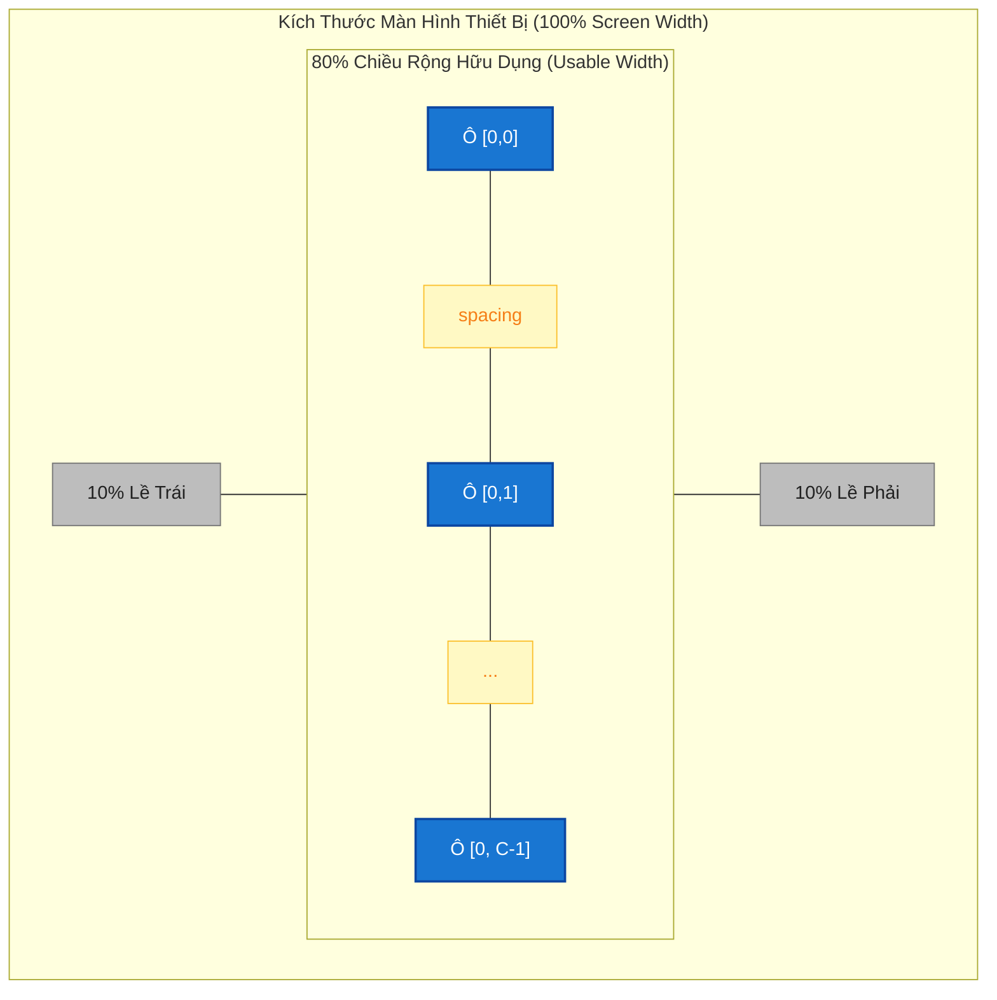
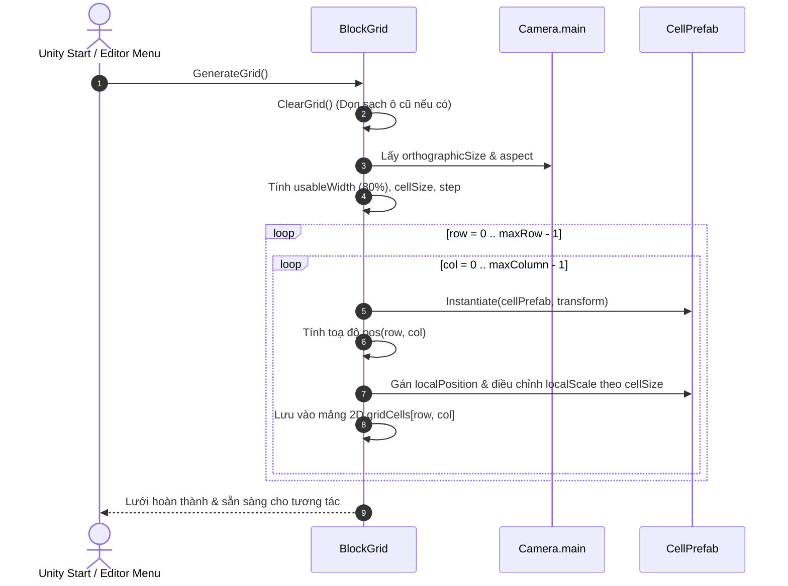
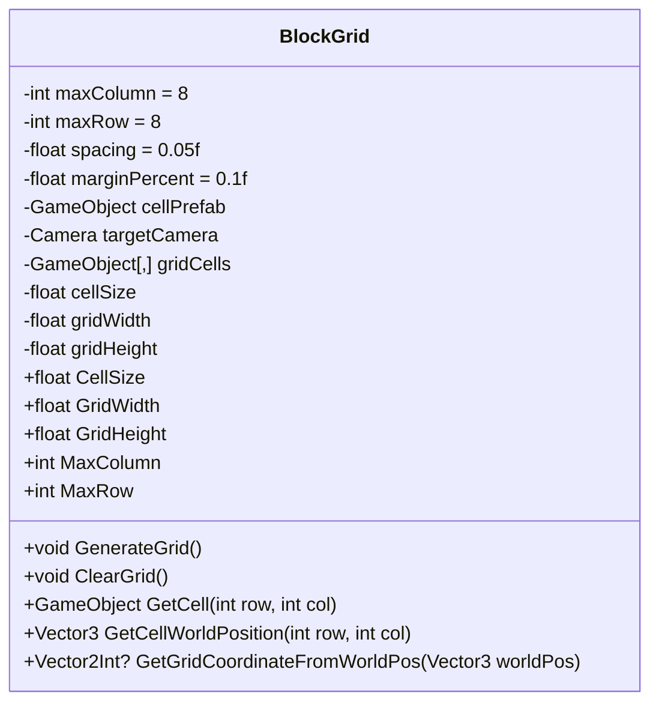

# Thiết Kế Kỹ Thuật: Sinh Lưới Tự Động (BlockGrid Generation Design)

> **Ngày tạo:** 2026-09-29  
> **Tài liệu tham chiếu:** [`.agents/rules/architecture.md`](file:///Users/minhquang/Documents/Unity%20Project/BlockDrag/.agents/rules/architecture.md) & [`.agents/rules/task_planning.md`](file:///Users/minhquang/Documents/Unity%20Project/BlockDrag/.agents/rules/task_planning.md)  
> **File mã nguồn mục tiêu:** [`BlockGrid.cs`](file:///Users/minhquang/Documents/Unity%20Project/BlockDrag/Assets/_Game/_BlockDrag/BlockGrid.cs)  
> **Module Assembly:** [`BlockDrag.asmdef`](file:///Users/minhquang/Documents/Unity%20Project/BlockDrag/Assets/_Game/_BlockDrag/BlockDrag.asmdef)

---

## 1. Yêu Cầu & Giả Định (Requirements & Assumptions)

### 1.1. Yêu cầu nghiệp vụ:
- **Kích thước lưới**: Khai báo linh hoạt số hàng (`maxRow`) và số cột (`maxColumn`) trên Inspector.
- **Vị trí và căn lề**:
  - Grid nằm chính giữa màn hình thiết bị (World Space hoặc theo vị trí Transform cha).
  - Cách đều mép trái và mép phải màn hình $10\%$ chiều ngang màn hình.
  - Vùng hiển thị hữu dụng của Grid: $\text{usableWidth} = \text{screenWidth} \times 80\%$.
- **Kích thước phần tử (`cellSize`)**:
  - Mỗi item trong Grid là một hình vuông hoàn hảo ($1 \times 1$).
  - Biến `spacing` được cấu hình để tạo khoảng hở giữa các ô liền kề.
  - Khi có `spacing`, kích thước ô được co lại để tổng bề ngang toàn bộ Grid vẫn khớp chính xác $80\%$ chiều ngang màn hình (giữ trọn vẹn $10\%$ padding 2 bên mép).
- **Khởi tạo trực quan (Visualization)**:
  - Sinh (Instantiate) `cellPrefab` cho từng tọa độ `(row, col)`.
  - Tự động điều chỉnh scale của `cellPrefab` dựa trên kích thước thực tế của Sprite để cạnh hiển thị bằng đúng `cellSize`.

---

## 2. Mô Hình Toán Học & Tọa Độ (Mathematical Model)

### 2.1. Tính toán không gian hiển thị Camera (Orthographic 2D)
```csharp
Camera cam = targetCamera != null ? targetCamera : Camera.main;
float screenWorldHeight = cam.orthographicSize * 2f;
float screenWorldWidth = screenWorldHeight * cam.aspect;
float usableWidth = screenWorldWidth * (1f - 2f * marginPercent); // marginPercent = 0.1f (10%)
```

### 2.2. Tính toán kích thước cạnh ô (`cellSize`)
Với $C = \text{maxColumn}$ cột, số khe hở giữa các ô là $C - 1$:
$$\text{totalSpacingX} = (C - 1) \times \text{spacing}$$
$$\text{cellSize} = \frac{\text{usableWidth} - \text{totalSpacingX}}{C}$$
$$\text{step} = \text{cellSize} + \text{spacing}$$

Tổng kích thước Grid:
$$\text{gridWidth} = C \times \text{cellSize} + (C - 1) \times \text{spacing} \equiv \text{usableWidth}$$
$$\text{gridHeight} = R \times \text{cellSize} + (R - 1) \times \text{spacing} \quad (\text{với } R = \text{maxRow})$$

### 2.3. Tọa độ cục bộ của từng ô `(row, col)`
Quy ước: Hàng $r = 0$ nằm ở trên cùng, tương thích với logic xoay và xếp khối trong [`BlockShape.cs`](file:///Users/minhquang/Documents/Unity%20Project/BlockDrag/Assets/_Game/_BlockDrag/BlockShape.cs).
$$\text{startX} = -\frac{\text{gridWidth}}{2} + \frac{\text{cellSize}}{2}$$
$$\text{startY} = \frac{\text{gridHeight}}{2} - \frac{\text{cellSize}}{2}$$
$$\vec{P}(r, c) = \left( \text{startX} + c \times \text{step}, \;\; \text{startY} - r \times \text{step}, \;\; 0 \right)$$

---

## 3. Sơ Đồ Thiết Kế Trực Quan (Mermaid Diagrams)

### 3.1. Sơ đồ phân bố bố cục màn hình (Layout Diagram)


### 3.2. Sơ đồ luồng thực thi (Sequence Workflow)


---

## 4. Thiết Kế Lớp & API ([`BlockGrid.cs`](file:///Users/minhquang/Documents/Unity%20Project/BlockDrag/Assets/_Game/_BlockDrag/BlockGrid.cs))



### Chi tiết các thuộc tính & phương thức:
1. `maxColumn`, `maxRow`: Số cột, số hàng cấu hình được trên Inspector.
2. `spacing`: Khoảng cách cách nhau giữa các ô.
3. `marginPercent`: Tỷ lệ lề 2 bên màn hình (mặc định $0.1 = 10\%$).
4. `cellPrefab`: Prefab ô vuông 1x1 (có SpriteRenderer).
5. `targetCamera`: Cho phép gán cụ thể Camera hoặc tự động fallback về `Camera.main`.
6. `CellSize`: Getter cho các component khác (như `BlockSpawner`, `BlockShape`) lấy kích thước để scale khối gạch khi nhặt / kéo thả.
7. `GetCellWorldPosition(r, c)`: Trả về tọa độ World để snap block chính xác vào tâm ô.
8. `GetGridCoordinateFromWorldPos(worldPos)`: Hỗ trợ logic thả khối kiểm tra ô gần nhất.
