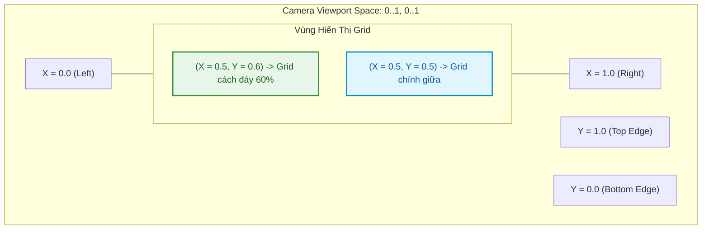
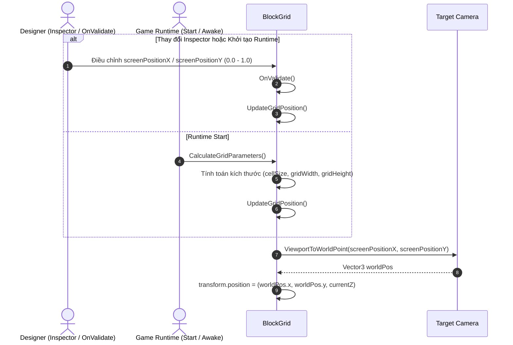

# Thiết Kế Kỹ Thuật: Cấu Hình Tỷ Lệ Vị Trí Grid Trên Màn Hình (BlockGrid Screen Position Ratio)

> **Ngày tạo:** 2026-09-29  
> **Tài liệu tham chiếu:** [`.agents/rules/architecture.md`](file:///Users/minhquang/Documents/Unity/ITCProjects/BlockDrag/.agents/rules/architecture.md) & [`.agents/rules/task_planning.md`](file:///Users/minhquang/Documents/Unity/ITCProjects/BlockDrag/.agents/rules/task_planning.md)  
> **File mã nguồn mục tiêu:** [`BlockGrid.cs`](file:///Users/minhquang/Documents/Unity/ITCProjects/BlockDrag/Assets/_Game/_BlockDrag/BlockGrid.cs)  
> **Module Assembly:** [`BlockDrag.asmdef`](file:///Users/minhquang/Documents/Unity/ITCProjects/BlockDrag/Assets/_Game/_BlockDrag/BlockDrag.asmdef)

---

## 1. Yêu Cầu & Giả Định (Requirements & Assumptions)

### 1.1. Yêu cầu nghiệp vụ:
- Cho phép lập trình viên / designer cấu hình vị trí tâm của `BlockGrid` trên màn hình thông qua tỷ lệ Viewport (`0.0` đến `1.0`).
- **Trục Y (Vertical Ratio)**:
  - `0.0`: Cạnh dưới màn hình (Bottom).
  - `0.5`: Chính giữa màn hình (Center).
  - `0.6`: Cách cạnh dưới $60\%$ chiều cao màn hình.
  - `1.0`: Cạnh trên màn hình (Top).
- **Trục X (Horizontal Ratio)**:
  - `0.0`: Cạnh trái màn hình (Left).
  - `0.5`: Chính giữa màn hình theo chiều ngang (Center).
  - `1.0`: Cạnh phải màn hình (Right).
- **Tương thích ngược (Backward Compatibility)**:
  - Giữ nguyên biến `centerOnCamera` để không làm mất serialization trong các Scene sẵn có như `GameScene.unity`.
  - Mặc định `screenPositionX = 0.5f` và `screenPositionY = 0.5f` để hành vi mặc định vẫn là nằm giữa màn hình như trước.
- **Trải nghiệm Editor (Editor Experience)**:
  - Cung cấp thuộc tính `[Range(0f, 1f)]` hiển thị slider trực quan trên Inspector.
  - Tích hợp `OnValidate()` để khi kéo slider trong Editor, vị trí của Grid được cập nhật tức thì trên Scene View mà không cần nhấn Play hay Generate lại toàn bộ các ô cell.

---

## 2. Mô Hình Toán Học & Chuyển Đổi Tọa Độ (Mathematical Model)

### 2.1. Quy đổi từ tỷ lệ Viewport sang World Position
Unity Camera cung cấp hàm `ViewportToWorldPoint`:
- Viewport space được chuẩn hóa: `(0, 0)` là góc dưới-trái, `(1, 1)` là góc trên-phải.
- Tâm của Grid được tính theo công thức:
```csharp
Vector3 screenTarget = new Vector3(screenPositionX, screenPositionY, cam.nearClipPlane);
Vector3 worldTarget = cam.ViewportToWorldPoint(screenTarget);
worldTarget.z = transform.position.z; // Bảo toàn độ sâu Z trong không gian 2D
transform.position = worldTarget;
```

---

## 3. Sơ Đồ Thiết Kế Trực Quan (Mermaid Diagrams)

### 3.1. Sơ đồ không gian hiển thị Viewport (Viewport Space Representation)


### 3.2. Sơ đồ tương tác và luồng cập nhật vị trí (Update Flow)


---

## 4. Thiết Kế Kiến Trúc & API (Architecture & API Design)

### 4.1. Các trường Serialized mới và cập nhật trong `BlockGrid.cs`:
```csharp
[Header("Positioning & Offset")]
[Tooltip("Nếu bật, tự động căn vị trí Grid theo tỷ lệ màn hình Camera. Nếu tắt, giữ nguyên transform.position")]
[SerializeField] protected bool centerOnCamera = true;

[Tooltip("Tỷ lệ vị trí tâm Grid theo chiều ngang màn hình (0: Mép trái, 0.5: Giữa, 1: Mép phải)")]
[Range(0f, 1f)]
[SerializeField] protected float screenPositionX = 0.5f;

[Tooltip("Tỷ lệ vị trí tâm Grid theo chiều dọc màn hình (0: Mép dưới, 0.5: Giữa, 0.6: Cách đáy 60%, 1: Mép trên)")]
[Range(0f, 1f)]
[SerializeField] protected float screenPositionY = 0.5f;
```

### 4.2. Phương thức hỗ trợ tách biệt (`UpdateGridPosition`):
```csharp
public void UpdateGridPosition()
{
    if (!centerOnCamera) return;

    Camera cam = targetCamera != null ? targetCamera : Camera.main;
    if (cam == null) return;

    Vector3 targetPos = cam.ViewportToWorldPoint(new Vector3(screenPositionX, screenPositionY, cam.nearClipPlane));
    targetPos.z = transform.position.z;
    transform.position = targetPos;
}
```

### 4.3. Public Properties & OnValidate:
- Expose `ScreenPositionX`, `ScreenPositionY`, `CenterOnCamera`.
- Tích hợp `OnValidate()` để cập nhật tức thời vị trí `UpdateGridPosition()` khi designer kéo thanh trượt trên Editor mà không phá hủy cấu trúc các cell đã sinh.
