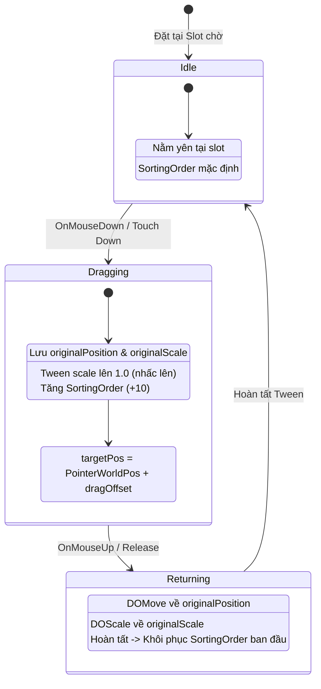
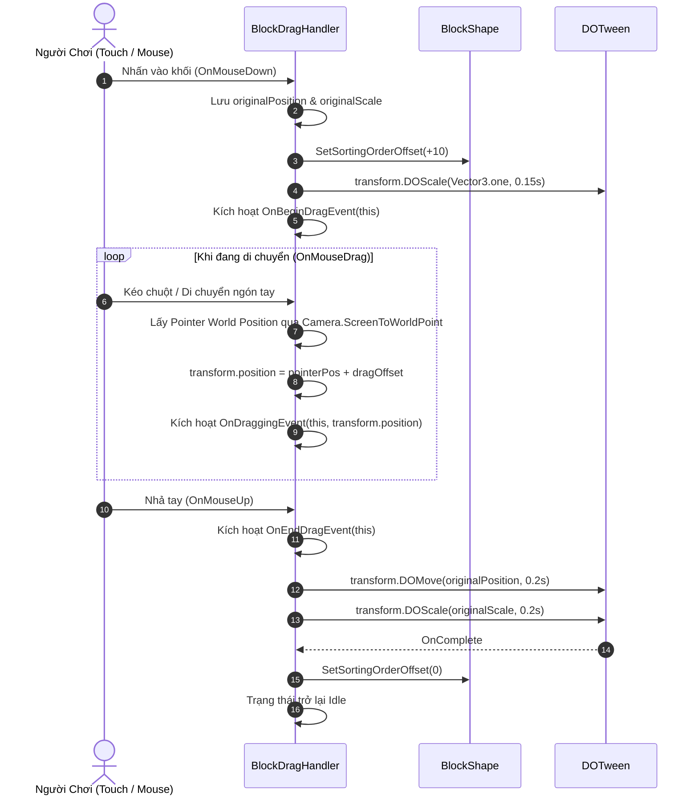

# Thiết Kế Kỹ Thuật: Hệ Thống Kéo Thả Cho BlockShape (BlockShape Drag Handler)

> **Ngày tạo:** 2026-09-29  
> **Tài liệu tham chiếu:** [`.agents/rules/architecture.md`](file:///Users/minhquang/Documents/Unity/ITCProjects/BlockDrag/.agents/rules/architecture.md) & [`.agents/rules/task_planning.md`](file:///Users/minhquang/Documents/Unity/ITCProjects/BlockDrag/.agents/rules/task_planning.md)  
> **File mã nguồn mục tiêu:**  
> - [`Assets/_Game/_BlockDrag/BlockShape.cs`](file:///Users/minhquang/Documents/Unity/ITCProjects/BlockDrag/Assets/_Game/_BlockDrag/BlockShape.cs)  
> - [`Assets/_Game/_BlockDrag/BlockDragHandler.cs`](file:///Users/minhquang/Documents/Unity/ITCProjects/BlockDrag/Assets/_Game/_BlockDrag/BlockDragHandler.cs) (Tạo mới)  
> - [`Assets/_Game/_BlockDrag/BlockDrag.asmdef`](file:///Users/minhquang/Documents/Unity/ITCProjects/BlockDrag/Assets/_Game/_BlockDrag/BlockDrag.asmdef)  
> **Prefab mục tiêu:** [`Assets/_Game/_BlockDrag/Prefabs/BlockShape.prefab`](file:///Users/minhquang/Documents/Unity/ITCProjects/BlockDrag/Assets/_Game/_BlockDrag/Prefabs/BlockShape.prefab)

---

## 1. Yêu Cầu & Giả Định (Requirements & Assumptions)

### 1.1. Yêu cầu nghiệp vụ:
- Cho phép người chơi tương tác chạm / kéo thả khối gạch `BlockShape` bằng chuột (trên PC/Editor) hoặc ngón tay (trên Mobile Touch).
- **Trải nghiệm kéo thả tối ưu (UX Optimization)**:
  - **Lift Offset**: Khi kéo, khối gạch được dịch chuyển nhấc lên trên ngón tay một khoảng theo trục Y (`dragOffset = (0, 1.5f, 0)`) để ngón tay không che khuất hình khối khi định vị trên Grid.
  - **Scale Feedback**: Trong slot chờ ở khay đáy màn hình, khối gạch có thể có scale nhỏ gọn; khi chạm nhấc lên kéo đi, khối gạch phóng to mượt mà (`DOScale`) về kích thước tỷ lệ chuẩn (1.0).
  - **Sorting Order**: Khi đang kéo, nâng `sortingOrder` của toàn bộ các Sprite trong khối gạch lên lớp hiển thị cao hơn (+10) để bảo đảm không bị các khối khác hoặc Grid che khuất.
  - **Return Animation**: Khi thả tay mà chưa đặt vào ô hợp lệ (hoặc thả ra ngoài), khối gạch tự động tween (`DOMove` & `DOScale`) mượt mà quay về vị trí ban đầu tại Slot trong khoảng thời gian ngắn (~0.2s), sau đó hoàn trả lại `sortingOrder` ban đầu.
- **Tách biệt kiến trúc (Architectural Separation)**:
  - Tách toàn bộ logic tương tác kéo thả sang script độc lập `BlockDragHandler.cs`, tuân thủ nguyên lý Đơn trách nhiệm (Single Responsibility Principle).
  - `BlockShape.cs` chỉ quản lý cấu trúc hình dạng, các ô con, màu sắc, và collider bounding box.
  - Cung cấp các C# Action/Event (`OnBeginDragEvent`, `OnDraggingEvent`, `OnEndDragEvent`) để sẵn sàng kết nối với `BlockGrid` trong các giai đoạn tiếp theo.

---

## 2. Thiết Kế Kiến Trúc & Thành Phần (Component Architecture)

### 2.1. Phân chia trách nhiệm:

```
+--------------------------------------------------------+
|                     BlockShape                         |
|  - Quản lý danh sách activeBlocks (SpriteRenderer)     |
|  - Khởi tạo khối theo BlockShapeData & BlockRotation   |
|  - Tính toán Bounding Box và cập nhật BoxCollider2D    |
|  - Hàm SetSortingOrder(int offset / int order)         |
+--------------------------------------------------------+
                           ^
                           | Tham chiếu & điều phối hiển thị
                           |
+--------------------------------------------------------+
|                  BlockDragHandler                      |
|  - Nhận input: OnMouseDown, OnMouseDrag, OnMouseUp     |
|  - Tính toán World Position từ con trỏ / touch         |
|  - Áp dụng dragOffset trục Y                           |
|  - Điều khiển Tweening (DOMove, DOScale) qua DOTween   |
|  - Bắn các sự kiện OnBeginDrag, OnDrag, OnEndDrag      |
+--------------------------------------------------------+
```

### 2.2. Vòng đời trạng thái (Drag State Machine):



---

## 3. Sơ Đồ Trình Tự Tương Tác (Sequence Diagram)



---

## 4. Đặc Tả Chi Tiết Kỹ Thuật (Technical Specifications)

### 4.1. Tự động tính toán Collider (`BlockShape.cs`):
Khi `BlockShape.Initialize(...)` hoàn thành việc sinh các ô con:
- Tính toán tổng thể `Bounds` của tất cả các block con cục bộ:
  ```csharp
  Bounds bounds = new Bounds(Vector3.zero, Vector3.zero);
  foreach (var block in activeBlocks)
  {
      bounds.Encapsulate(block.transform.localPosition);
  }
  ```
- Lấy hoặc thêm `BoxCollider2D` trên GameObject gốc của `BlockShape`:
  - `boxCollider.size = bounds.size + (Vector3)blockSize;` (đảm bảo bao trọn các ô 1x1).
  - `boxCollider.offset = bounds.center;`
- Điều này cho phép người chơi chạm vào bất kỳ điểm nào trên khối gạch để nhấc lên mà không cần tạo collider riêng lẻ cho từng ô con.

### 4.2. Quản lý Sorting Order (`BlockShape.cs`):
- Lưu trữ danh sách `SpriteRenderer` của các ô con.
- Cung cấp phương thức:
  ```csharp
  public void SetSortingOrderOffset(int offset)
  {
      for (int i = 0; i < activeBlocks.Count; i++)
      {
          var sr = activeBlocks[i].GetComponent<SpriteRenderer>();
          if (sr != null)
          {
              sr.sortingOrder = baseSortingOrder + offset;
          }
      }
  }
  ```

### 4.3. Thành phần kéo thả (`BlockDragHandler.cs`):
- **Các trường Serialized cấu hình**:
  - `[SerializeField] private Vector3 dragOffset = new Vector3(0f, 1.5f, 0f);`
  - `[SerializeField] private float dragScale = 1f;`
  - `[SerializeField] private float returnDuration = 0.2f;`
  - `[SerializeField] private Ease returnEase = Ease.OutQuad;`
  - `[SerializeField] private int dragSortingOrderOffset = 10;`
  - `[SerializeField] private Camera targetCamera;` (fallback `Camera.main`)
- **Quản lý Input**:
  - `OnMouseDown()`: Bắt đầu kéo, lưu `originalPosition = transform.position; originalScale = transform.localScale;`
  - `OnMouseDrag()`: Tính toán vị trí chuột/touch trên mặt phẳng Z của object:
    ```csharp
    Vector3 mouseScreen = Input.mousePosition;
    mouseScreen.z = Mathf.Abs(cam.transform.position.z - transform.position.z);
    Vector3 mouseWorld = cam.ScreenToWorldPoint(mouseScreen);
    transform.position = new Vector3(mouseWorld.x + dragOffset.x, mouseWorld.y + dragOffset.y, originalPosition.z);
    ```
  - `OnMouseUp()`: Chạy tween quay về ban đầu nếu chưa được xử lý thả hợp lệ.

### 4.4. Phụ thuộc Module (`BlockDrag.asmdef`):
- Thêm tham chiếu đến GUID của DOTween Modules: `"GUID:bd7cbe032296944a69986a3acfb90044"`.
