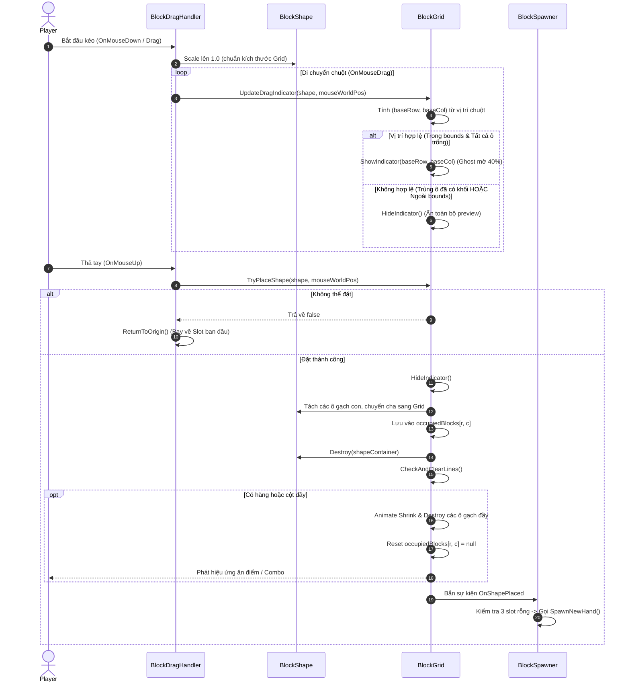
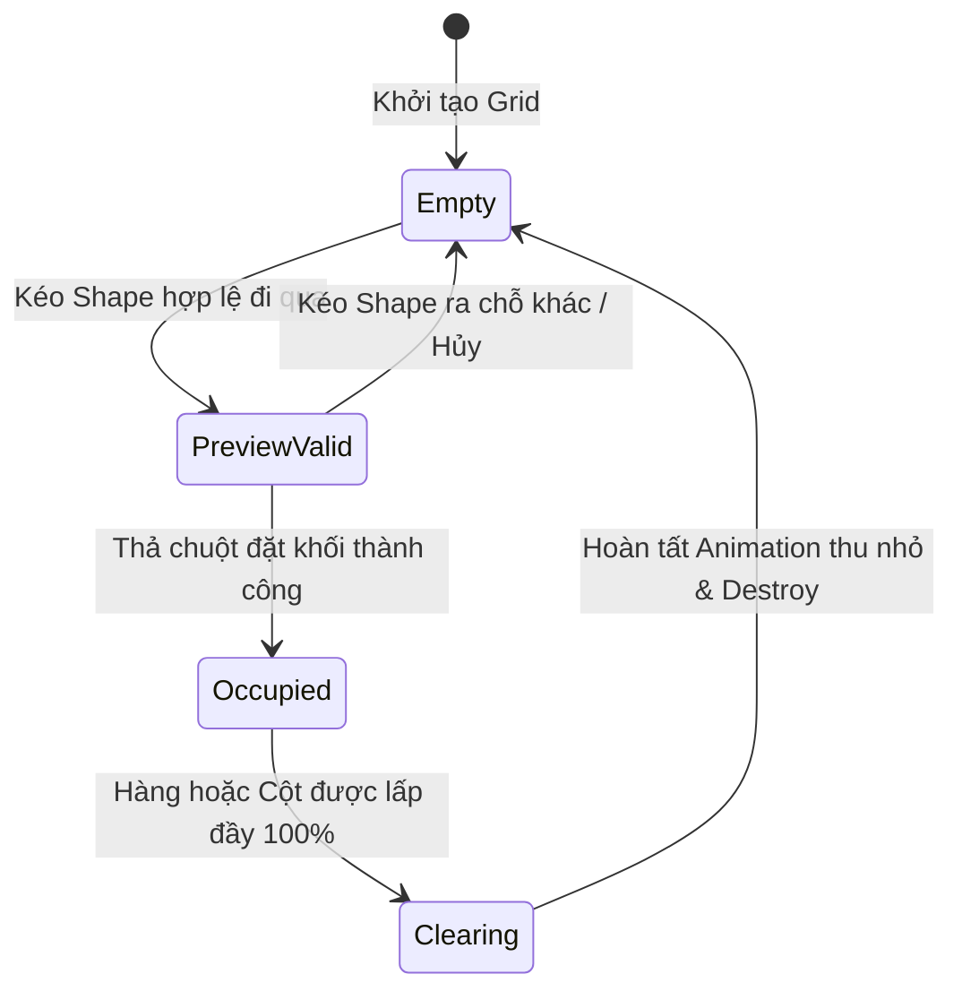

# Thiết Kế Kỹ Thuật: Cơ Chế Xếp Khối (Placement), Chỉ Báo (Indicator) & Phá Hàng (Line Clearing) Kiểu Block Blast

> **Ngày tạo:** 2026-10-02  
> **Tài liệu tham chiếu:** [`.agents/rules/architecture.md`](file:///Users/minhquang/Documents/Unity%20Project/BlockDrag/.agents/rules/architecture.md) & [`.agents/rules/task_planning.md`](file:///Users/minhquang/Documents/Unity%20Project/BlockDrag/.agents/rules/task_planning.md)  
> **Files liên quan:**  
> - [`Assets/_Game/_BlockDrag/BlockGrid.cs`](file:///Users/minhquang/Documents/Unity%20Project/BlockDrag/Assets/_Game/_BlockDrag/BlockGrid.cs)  
> - [`Assets/_Game/_BlockDrag/BlockShape.cs`](file:///Users/minhquang/Documents/Unity%20Project/BlockDrag/Assets/_Game/_BlockDrag/BlockShape.cs)  
> - [`Assets/_Game/_BlockDrag/BlockDragHandler.cs`](file:///Users/minhquang/Documents/Unity%20Project/BlockDrag/Assets/_Game/_BlockDrag/BlockDragHandler.cs)  
> - [`Assets/_Game/_BlockDrag/BlockSpawner.cs`](file:///Users/minhquang/Documents/Unity%20Project/BlockDrag/Assets/_Game/_BlockDrag/BlockSpawner.cs)  

---

## 1. Yêu Cầu & Bối Cảnh (Requirements & Context)

### 1.1. Mục tiêu từ yêu cầu người dùng
1. **Kéo thả và xếp khối lên Grid:**
   - Khi kéo `BlockShape` vào khu vực `BlockGrid`, khối có thể khớp và đặt cố định lên các ô trống tương ứng của Grid.
2. **Hiển thị Indicator (Ghost / Preview) có điều kiện:**
   - Khi đang kéo trên Grid, hiển thị preview/indicator tại các ô Grid mục tiêu nếu vị trí đó hợp lệ.
   - **Ràng buộc:** Nếu bất kỳ ô nào trong vùng đặt khối đã có khối gạch chiếm chỗ (occupied) hoặc nằm ngoài rìa Grid, **không hiển thị indicator** và **không cho phép đặt khối** tại vị trí đó.
3. **Cơ chế kiểm tra và phá hủy hàng ngang / hàng dọc (Line Clearing kiểu Block Blast):**
   - Sau khi đặt khối thành công, quét toàn bộ Grid để tìm các hàng ngang hoặc cột dọc đã được lấp đầy 100%.
   - Nếu có hàng/cột đầy: phát hiệu ứng thu nhỏ/mờ dần rồi phá hủy các khối gạch tại các ô đó.
   - Trả trạng thái ô về "chưa chứa khối gạch" (rỗng) để có thể tiếp tục nhận khối mới ở các lượt sau.
4. **Tự động cấp phát lượt khối mới (Spawn New Hand):**
   - Khi cả 3 khối trong 3 slot chờ đã được đặt hết lên Grid, tự động sinh 3 khối mới giống cơ chế của Block Blast.

---

## 2. Kiến Trúc & Thiết Kế Thành Phần (Architecture & Component Design)

### 2.1. Phân chia trách nhiệm (Single Responsibility Principle)

```text
┌─────────────────────────────────────────────────────────────┐
│                      BlockDragHandler                       │
│  - Xử lý tương tác Touch/Mouse Drag                         │
│  - Giao tiếp với BlockGrid: UpdateIndicator & TryPlaceShape │
│  - Fallback bay về vị trí cũ (ReturnToOrigin) nếu thả lỗi   │
└──────────────────────────────┬──────────────────────────────┘
                               │ điều khiển
                               ▼
┌─────────────────────────────────────────────────────────────┐
│                          BlockGrid                          │
│  - Quản lý ma trận chiếm chỗ (occupiedBlocks[row, col])     │
│  - Quy đổi toạ độ World -> Toạ độ ô Grid (baseRow, baseCol) │
│  - Kiểm tra tính hợp lệ khi đặt khối (CanPlaceShape)        │
│  - Quản lý hiển thị / ẩn Indicator (Ghost preview cells)    │
│  - Nhận khối đặt, reparent các ô gạch vào Grid              │
│  - Quét & phá huỷ hàng/cột hoàn thành (CheckAndClearLines)   │
└──────────────────────────────┬──────────────────────────────┘
                               │ thông báo hoàn tất
                               ▼
┌─────────────────────────────────────────────────────────────┐
│                        BlockSpawner                         │
│  - Lắng nghe sự kiện OnShapePlaced từ BlockGrid             │
│  - Kiểm tra nếu cả 3 slot đều trống -> gọi SpawnNewHand()   │
└─────────────────────────────────────────────────────────────┘
```

### 2.2. Chi tiết cấu trúc dữ liệu & thuật toán

#### A. Ma trận chiếm chỗ trên Grid
`BlockGrid` lưu trữ mảng 2 chiều chứa tham chiếu GameObject khối gạch:
```csharp
private GameObject[,] occupiedBlocks; // [maxRow, maxColumn]
```
- `occupiedBlocks[r, c] == null`: Ô đang trống.
- `occupiedBlocks[r, c] != null`: Ô đã có khối gạch chiếm giữ.

#### B. Quy đổi toạ độ từ World Space sang Grid Coordinate
Với tâm khối `shapeWorldPos`, toạ độ cục bộ trong `BlockGrid` là `shapeLocalPos`.
Vì `BlockShape` và `BlockGrid` chia sẻ cùng bước nhảy `step = cellSize + spacing` và cùng hệ trục (Row tăng dần theo hướng -Y, Col tăng dần theo hướng +X):
```csharp
float continuousCol = (shapeLocalPos.x - startX) / step - (shapeCols - 1) * 0.5f;
float continuousRow = (startY - shapeLocalPos.y) / step - (shapeRows - 1) * 0.5f;

int baseCol = Mathf.RoundToInt(continuousCol);
int baseRow = Mathf.RoundToInt(continuousRow);
```
Mỗi ô con `(r, c)` của khối sẽ chiếu chính xác lên ô `(baseRow + r, baseCol + c)` của `BlockGrid`.

#### C. Kiểm tra tính hợp lệ (Validation)
Vị trí `(baseRow, baseCol)` hợp lệ khi và chỉ khi:
Với mọi ô `(r, c)` mà `shape.HasBlockAt(r, c) == true`:
1. `0 <= baseRow + r < maxRow` (nằm trong phạm vi hàng).
2. `0 <= baseCol + c < maxColumn` (nằm trong phạm vi cột).
3. `occupiedBlocks[baseRow + r, baseCol + c] == null` (ô chưa bị chiếm).

Nếu vi phạm bất kỳ điều kiện nào $\rightarrow$ **Không hợp lệ** $\rightarrow$ Ẩn Indicator và từ chối đặt khối.

#### D. Hiển thị Indicator (Ghost Cells Pool)
- `BlockGrid` khởi tạo sẵn một danh sách các GameObject `indicatorCells` (tối đa bằng số block trong 1 shape, ví dụ 9 ô).
- Khi vị trí hợp lệ: Bật các `indicatorCells`, đặt vị trí tại `GetCellWorldPosition(baseRow + r, baseCol + c)`, gán scale `CellScale` và màu của Shape với độ trong suốt `alpha = 0.4f`.
- Khi không hợp lệ hoặc rời khỏi Grid: Tắt toàn bộ `indicatorCells`.

#### E. Cơ chế quét và phá hàng/cột (Line Clearing)
Ngay sau khi đặt khối:
1. Quét tìm tất cả các hàng đầy: Với mỗi hàng `r`, nếu tất cả `c` đều có `occupiedBlocks[r, c] != null` $\rightarrow$ Thêm `r` vào danh sách `fullRows`.
2. Quét tìm tất cả các cột đầy: Với mỗi cột `c`, nếu tất cả `r` đều có `occupiedBlocks[r, c] != null` $\rightarrow$ Thêm `c` vào danh sách `fullCols`.
3. Tập hợp các ô cần phá bằng `HashSet<Vector2Int>` (đảm bảo ô giao giữa hàng và cột đầy không bị xử lý 2 lần).
4. Thực hiện xóa:
   - Gán ngay `occupiedBlocks[r, c] = null` để cập nhật trạng thái logic tức thì.
   - Chạy DOTween hiệu ứng thu nhỏ (`scale -> 0`) và mờ dần (`alpha -> 0`) trong `0.2f` giây, sau đó `Destroy(blockObj)`.
5. Bắn sự kiện `OnLinesCleared(int rowsCount, int colsCount, int totalCellsCleared)` phục vụ âm thanh/điểm số sau này.

---

## 3. Biểu Đồ Trực Quan (Visual Diagrams)

### 3.1. Biểu đồ tuần tự: Toàn bộ vòng đời Kéo - Đặt - Phá khối (Sequence Diagram)



### 3.2. Biểu đồ trạng thái: Logic ô Grid (Cell State Diagram)



---

## 4. Đặc Tả Kỹ Thuật Chi Tiết (Technical Specifications)

### 4.1. Bổ sung trong `BlockShape.cs`
- Lưu trữ góc quay hiện tại:
  ```csharp
  public BlockRotation CurrentRotation { get; private set; } = BlockRotation.Rot_0;
  ```
- Cung cấp thuộc tính và phương thức tiện ích:
  ```csharp
  public int RowsCount => shapeData != null ? shapeData.GetRotatedRowsCount(CurrentRotation) : 0;
  public int ColumnsCount => shapeData != null ? shapeData.GetRotatedColumnsCount(CurrentRotation) : 0;
  public bool HasBlockAt(int r, int c) => shapeData != null && shapeData.HasBlockAtRotated(r, c, CurrentRotation);
  ```
- Lưu trữ ánh xạ tọa độ `(r, c) -> GameObject blockObj` để khi đặt khối lên Grid có thể trích xuất chính xác từng ô gạch con.

### 4.2. Bổ sung trong `BlockGrid.cs`
- Thêm mảng `occupiedBlocks = new GameObject[maxRow, maxColumn];`.
- Phương thức tính toán toạ độ:
  ```csharp
  public bool TryGetPlacementCoordinate(BlockShape shape, Vector3 shapeWorldPos, out Vector2Int baseCoord);
  ```
- Phương thức kiểm tra:
  ```csharp
  public bool CanPlaceShape(BlockShape shape, Vector2Int baseCoord);
  ```
- Phương thức quản lý Indicator:
  ```csharp
  public void UpdateDragIndicator(BlockShape shape, Vector3 shapeWorldPos);
  public void ShowIndicator(BlockShape shape, Vector2Int baseCoord);
  public void HideIndicator();
  ```
- Phương thức đặt khối:
  ```csharp
  public bool TryPlaceShape(BlockShape shape, Vector3 shapeWorldPos);
  ```
- Phương thức quét và phá hàng/cột:
  ```csharp
  public void CheckAndClearLines();
  ```

### 4.3. Bổ sung trong `BlockDragHandler.cs`
- Tham chiếu `BlockGrid`: Tự động tìm trong `Awake()` hoặc nhận qua hàm khởi tạo.
- Trong `OnMouseDrag`: Gọi `blockGrid.UpdateDragIndicator(blockShape, transform.position)`.
- Trong `OnMouseUp`:
  ```csharp
  bool placed = false;
  if (blockGrid != null)
  {
      placed = blockGrid.TryPlaceShape(blockShape, transform.position);
  }
  if (!placed)
  {
      ReturnToOrigin();
  }
  ```

### 4.4. Bổ sung trong `BlockSpawner.cs`
- Đăng ký lắng nghe sự kiện `blockGrid.OnShapePlaced += OnShapePlacedHandler;`.
- Khi một khối được đặt, kiểm tra xem cả 3 slot đã trống chưa. Nếu cả 3 trống thì gọi `SpawnNewHand()`.
