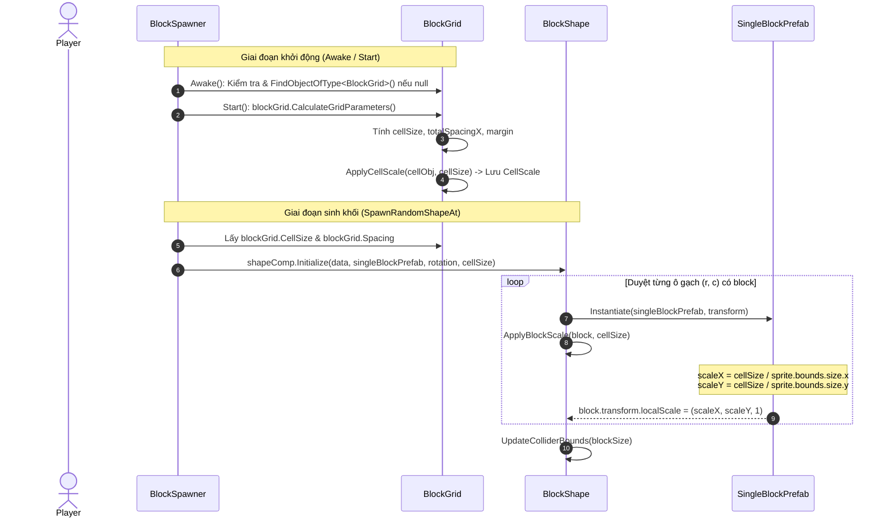

# Thiết Kế Kỹ Thuật: Đồng Bộ Tỷ Lệ (Scale) Của SingleBlockPrefab Với CellObj Trong BlockGrid

> **Ngày tạo:** 2026-10-02  
> **Tài liệu tham chiếu:** [`.agents/rules/architecture.md`](file:///Users/minhquang/Documents/Unity%20Project/BlockDrag/.agents/rules/architecture.md) & [`.agents/rules/task_planning.md`](file:///Users/minhquang/Documents/Unity%20Project/BlockDrag/.agents/rules/task_planning.md)  
> **Files liên quan:**  
> - [`Assets/_Game/_BlockDrag/BlockGrid.cs`](file:///Users/minhquang/Documents/Unity%20Project/BlockDrag/Assets/_Game/_BlockDrag/BlockGrid.cs)  
> - [`Assets/_Game/_BlockDrag/BlockShape.cs`](file:///Users/minhquang/Documents/Unity%20Project/BlockDrag/Assets/_Game/_BlockDrag/BlockShape.cs)  
> - [`Assets/_Game/_BlockDrag/BlockSpawner.cs`](file:///Users/minhquang/Documents/Unity%20Project/BlockDrag/Assets/_Game/_BlockDrag/BlockSpawner.cs)  

---

## 1. Yêu Cầu & Bối Cảnh (Requirements & Context)

### 1.1. Thực trạng hiện tại
1. **Thiếu Scale cho Block con trong `BlockShape`:**  
   Trong [`BlockShape.Initialize`](file:///Users/minhquang/Documents/Unity%20Project/BlockDrag/Assets/_Game/_BlockDrag/BlockShape.cs#L26), khi các ô gạch con (`singleBlockPrefab`) được `Instantiate`, chúng chỉ được gán toạ độ `localPosition` mà không hề được cập nhật `localScale`. Do đó, các block con giữ nguyên `localScale = (1, 1, 1)` của prefab gốc.
2. **`BlockGrid` đã có cơ chế tính `cellSize` và `ApplyCellScale`:**  
   Trong [`BlockGrid.cs`](file:///Users/minhquang/Documents/Unity%20Project/BlockDrag/Assets/_Game/_BlockDrag/BlockGrid.cs#L178), mỗi `cellObj` được tính toán tỉ lệ thu phóng dựa vào `cellSize / spriteSize` để vừa khít với kích thước màn hình:
   ```csharp
   float scaleX = spriteSize.x > 0f ? (targetSize / spriteSize.x) : 1f;
   float scaleY = spriteSize.y > 0f ? (targetSize / spriteSize.y) : 1f;
   cellObj.transform.localScale = new Vector3(scaleX, scaleY, 1f);
   ```
3. **Lỗi phụ thuộc `blockGrid == null` trong `BlockSpawner`:**  
   Field `public BlockGrid blockGrid;` trong [`BlockSpawner.cs`](file:///Users/minhquang/Documents/Unity%20Project/BlockDrag/Assets/_Game/_BlockDrag/BlockSpawner.cs#L14) chưa được gán trên Scene Inspector và thiếu code phòng vệ tự động tìm (`FindObjectOfType<BlockGrid>()`), dẫn đến `gridCellSize = 0f` khi spawn.

### 1.2. Mục tiêu kỹ thuật
- Mỗi ô gạch con (`singleBlockPrefab`) trong `BlockShape` phải có `localScale` chính xác bằng `localScale` của các ô `cellObj` trong `BlockGrid` sau khi đã `ApplyCellScale`.
- Khắc phục triệt để lỗi `blockGrid == null` trong `BlockSpawner` bằng cách tự động tìm kiếm trong `Awake()`.
- Công khai hóa (hoặc tái sử dụng) logic scale từ `BlockGrid` để cả `BlockGrid` và `BlockShape` cùng chia sẻ chuẩn tính toán.

---

## 2. Thiết Kế Kiến Trúc & Luồng Dữ Liệu (Architecture & Data Flow)

### 2.1. Phân chia trách nhiệm (Responsibilities)
- **`BlockGrid`**:
  - Tính toán `cellSize` chuẩn theo tỉ lệ Camera & màn hình.
  - Cung cấp thuộc tính `CellScale` (`Vector3`) đại diện cho `localScale` của một ô chuẩn.
  - Cho phép gọi `ApplyCellScale(GameObject obj, float targetSize)` hoặc `ApplyCellScale(GameObject obj)` công khai (public).
- **`BlockSpawner`**:
  - Tự động gán `blockGrid = FindObjectOfType<BlockGrid>()` trong `Awake()` nếu chưa được gán qua Inspector.
  - Đảm bảo `blockGrid.CalculateGridParameters()` đã chạy để có `CellSize` trước khi spawn khối.
  - Truyền `gridCellSize` và đồng bộ `spacing` cho `BlockShape`.
- **`BlockShape`**:
  - Nhận `cellSize` từ `Initialize(...)`.
  - Khi `Instantiate(singleBlockPrefab, transform)`, gọi hàm cập nhật `localScale` cho block con theo `cellSize` (áp dụng cùng thuật toán `targetSize / spriteSize`).

### 2.2. Biểu đồ tuần tự (Sequence Diagram)



---

## 3. Chi Tiết Kỹ Thuật (Technical Specifications)

### 3.1. Cập nhật `BlockGrid.cs`
- Thêm thuộc tính lưu trữ scale chuẩn:
  ```csharp
  public Vector3 CellScale { get; protected set; } = Vector3.one;
  ```
- Chuyển `ApplyCellScale` thành `public` để tái sử dụng:
  ```csharp
  public void ApplyCellScale(GameObject cellObj, float targetSize)
  {
      if (cellObj == null) return;
      var spriteRenderer = cellObj.GetComponent<SpriteRenderer>();
      if (spriteRenderer != null && spriteRenderer.sprite != null)
      {
          Vector2 spriteSize = spriteRenderer.sprite.bounds.size;
          float scaleX = spriteSize.x > 0f ? (targetSize / spriteSize.x) : 1f;
          float scaleY = spriteSize.y > 0f ? (targetSize / spriteSize.y) : 1f;
          cellObj.transform.localScale = new Vector3(scaleX, scaleY, 1f);
      }
      else
      {
          cellObj.transform.localScale = new Vector3(targetSize, targetSize, 1f);
      }
      CellScale = cellObj.transform.localScale;
  }
  ```

### 3.2. Cập nhật `BlockShape.cs`
- Thêm hàm `ApplyBlockScale(GameObject blockObj, float targetSize)` trong `BlockShape`:
  ```csharp
  private void ApplyBlockScale(GameObject blockObj, float targetSize)
  {
      if (blockObj == null || targetSize <= 0f) return;
      var spriteRenderer = blockObj.GetComponent<SpriteRenderer>();
      if (spriteRenderer != null && spriteRenderer.sprite != null)
      {
          Vector2 spriteSize = spriteRenderer.sprite.bounds.size;
          float scaleX = spriteSize.x > 0f ? (targetSize / spriteSize.x) : 1f;
          float scaleY = spriteSize.y > 0f ? (targetSize / spriteSize.y) : 1f;
          blockObj.transform.localScale = new Vector3(scaleX, scaleY, 1f);
      }
      else
      {
          blockObj.transform.localScale = new Vector3(targetSize, targetSize, 1f);
      }
  }
  ```
- Trong `BlockShape.Initialize(...)`, ngay sau khi `Instantiate(singleBlockPrefab, transform)`:
  ```csharp
  ApplyBlockScale(block, blockSize.x);
  ```

### 3.3. Cập nhật `BlockSpawner.cs`
- Thêm cơ chế tự động tìm `BlockGrid` trong `Awake()`:
  ```csharp
  private void Awake()
  {
      if (blockGrid == null)
      {
          blockGrid = FindObjectOfType<BlockGrid>();
      }
  }
  ```
- Đảm bảo trong `Start()`, `blockGrid.CalculateGridParameters()` luôn chạy trước khi sinh các slot chờ và khối gạch.
