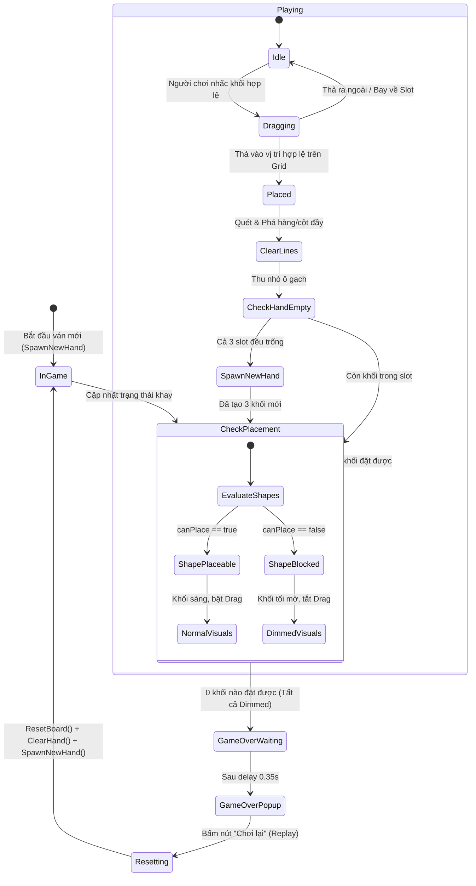
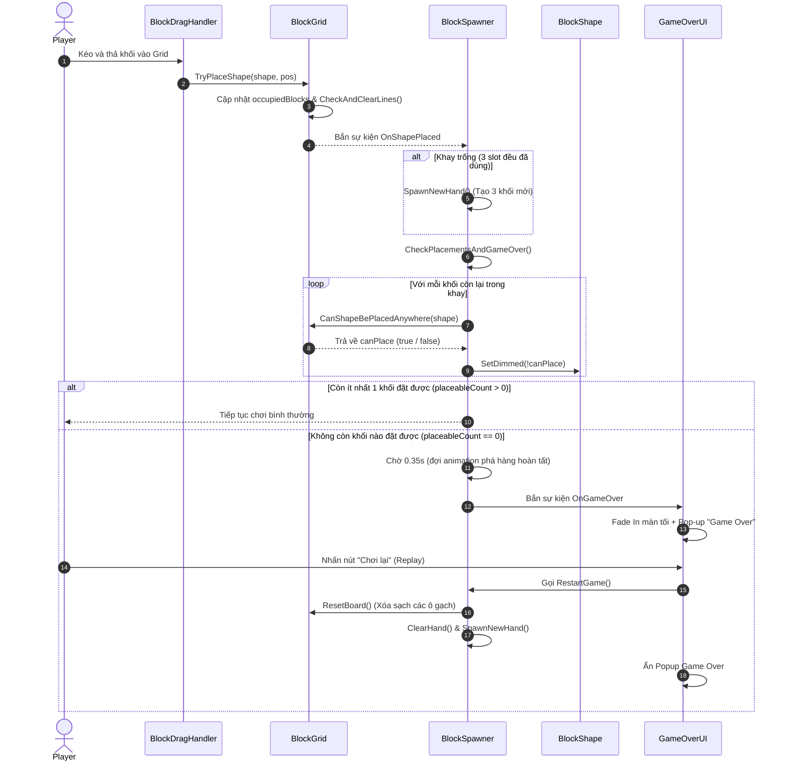

# Thiết Kế Kỹ Thuật: Cơ Chế Kiểm Tra Thua (Game Over Check) & Khối Không Thể Đặt Kiểu Block Blast

> **Ngày tạo:** 2026-10-03  
> **Tài liệu tham chiếu:** [`.agents/rules/architecture.md`](file:///Users/minhquang/Documents/Unity%20Project/BlockDrag/.agents/rules/architecture.md) & [`.agents/rules/task_planning.md`](file:///Users/minhquang/Documents/Unity%20Project/BlockDrag/.agents/rules/task_planning.md)  
> **Files liên quan:**  
> - [`Assets/_Game/_BlockDrag/BlockGrid.cs`](file:///Users/minhquang/Documents/Unity%20Project/BlockDrag/Assets/_Game/_BlockDrag/BlockGrid.cs)  
> - [`Assets/_Game/_BlockDrag/BlockShape.cs`](file:///Users/minhquang/Documents/Unity%20Project/BlockDrag/Assets/_Game/_BlockDrag/BlockShape.cs)  
> - [`Assets/_Game/_BlockDrag/BlockDragHandler.cs`](file:///Users/minhquang/Documents/Unity%20Project/BlockDrag/Assets/_Game/_BlockDrag/BlockDragHandler.cs)  
> - [`Assets/_Game/_BlockDrag/BlockSpawner.cs`](file:///Users/minhquang/Documents/Unity%20Project/BlockDrag/Assets/_Game/_BlockDrag/BlockSpawner.cs)  
> - [`Assets/_Game/_BlockDrag/GameOverUI.cs`](file:///Users/minhquang/Documents/Unity%20Project/BlockDrag/Assets/_Game/_BlockDrag/GameOverUI.cs) *(mới)*  

---

## 1. Yêu Cầu & Bối Cảnh (Requirements & Context)

### 1.1. Mục tiêu từ yêu cầu người dùng
1. **Kiểm tra điều kiện thua (Check Game Over):**
   - Khi không còn bất kỳ khối nào trong số các khối đang chờ tại các slot có thể đặt vừa vào bất kỳ vị trí nào trên bàn cờ (`BlockGrid`), trò chơi xác định người chơi đã **Thua (Game Over)**.
2. **Hiệu ứng làm mờ khối không thể đặt (Dimming Shapes - Chuẩn Block Blast):**
   - Sau mỗi nước đi và sau khi phá hàng, hệ thống đánh giá từng khối còn lại trong khay chờ:
     - Nếu một khối không còn vị trí trống nào vừa vặn trên bàn cờ: làm tối/mờ khối đó (giảm Alpha / Color tối đi) và tạm thời vô hiệu hóa khả năng kéo thả của khối đó.
     - Nếu một khối có thể đặt được (hoặc sau khi phá hàng mở ra chỗ trống mới giúp khối đó đặt được): khôi phục màu sắc rực rỡ bình thường và cho phép kéo thả.
3. **Hiển thị giao diện Thua (Game Over UI / Popup) & Chơi lại (Replay):**
   - Khi tất cả các khối còn lại đều không thể đặt được $\rightarrow$ Game Over!
   - Chờ hoàn tất hiệu ứng phá hàng (khoảng 0.3s - 0.4s) rồi hiển thị bảng thông báo Game Over với hiệu ứng chuyển động mượt mà (Fade In overlay + Popup scale).
   - Nút "Chơi lại" (Replay / Play Again) cho phép xóa sạch các khối trên bàn cờ (`ResetBoard`), dọn sạch khay và sinh 3 khối mới (`SpawnNewHand`) để bắt đầu ván mới.

---

## 2. Kiến Trúc & Thiết Kế Thành Phần (Architecture & Component Design)

### 2.1. Phân chia trách nhiệm (Single Responsibility Principle)

```text
┌─────────────────────────────────────────────────────────────┐
│                          BlockGrid                          │
│  - Lưu trữ ma trận occupiedBlocks[r, c]                     │
│  - CanPlaceShape(shape, coord): Kiểm tra đặt tại 1 ô        │
│  - CanShapeBePlacedAnywhere(shape): Quét toàn bộ Grid       │
│  - ResetBoard(): Xóa toàn bộ khối gạch ghim trên Grid       │
└──────────────────────────────┬──────────────────────────────┘
                               │ cung cấp truy vấn logic
                               ▼
┌─────────────────────────────────────────────────────────────┐
│                        BlockSpawner                         │
│  - Quản lý các slot chứa khối (spawnSlots)                  │
│  - Sau mỗi lần đặt khối:                                    │
│      + Nếu hết khối -> SpawnNewHand()                       │
│      + Quét từng khối: shape.SetDimmed(!canPlace)           │
│      + Nếu tất cả đều dimmed -> Bắn OnGameOver              │
│  - Cung cấp hàm RestartGame() để chơi lại ván mới           │
└──────────────┬──────────────────────────────┬───────────────┘
               │ điều khiển trạng thái        │ bắn sự kiện
               ▼                              ▼
┌──────────────────────────────┐ ┌────────────────────────────┐
│          BlockShape          │ │         GameOverUI         │
│  - SetDimmed(bool dimmed)    │ │  - Lắng nghe OnGameOver    │
│  - Đổi màu/alpha renderers   │ │  - Hiện Overlay + Popup    │
│  - Bật/tắt BoxCollider2D     │ │  - Nút Replay gọi          │
│                              │ │    BlockSpawner.RestartGame│
└──────────────────────────────┘ └────────────────────────────┘
```

### 2.2. Chi tiết thuật toán & luồng dữ liệu

#### A. Thuật toán kiểm tra khối có đặt được vào Grid hay không
- Đã có sẵn hàm `CanShapeBePlacedAnywhere(BlockShape shape)` trong [`BlockGrid`](file:///Users/minhquang/Documents/Unity%20Project/BlockDrag/Assets/_Game/_BlockDrag/BlockGrid.cs):
  - Kích thước khối: `shapeRows`, `shapeCols`.
  - Giới hạn quét: `maxR = maxRow - shapeRows`, `maxC = maxColumn - shapeCols`.
  - Quét qua mọi vị trí `(r, c)` từ `[0, maxR]` và `[0, maxC]`:
    - Nếu tại bất kỳ `(r, c)` nào mà `CanPlaceShape(shape, Vector2Int(r, c))` trả về `true` $\rightarrow$ Khối này **có thể đặt được** (return `true`).
  - Nếu duyệt hết mà không có ô nào vừa $\rightarrow$ Khối này **bị kẹt** (return `false`).

#### B. Cơ chế làm mờ (Dimming) trên `BlockShape`
- Trong [`BlockShape`](file:///Users/minhquang/Documents/Unity%20Project/BlockDrag/Assets/_Game/_BlockDrag/BlockShape.cs):
  - Thêm thuộc tính `public bool IsDimmed { get; private set; }`
  - Thêm phương thức `public void SetDimmed(bool dimmed)`:
    - Nếu `dimmed == true`:
      - Giảm độ sáng và độ trong suốt của tất cả `cachedRenderers`: `Color.Lerp(originalColor, Color.black, 0.5f)` với `alpha = 0.45f`.
      - Vô hiệu hóa `BoxCollider2D` để người chơi không nhấc khối đó lên.
    - Nếu `dimmed == false`:
      - Khôi phục màu gốc `shapeData.shapeColor` với `alpha = 1f`.
      - Kích hoạt lại `BoxCollider2D`.

#### C. Luồng kiểm tra sau mỗi nước đi (`BlockSpawner.CheckGameOver`)
- Khi sự kiện `OnShapePlaced` kích hoạt:
  1. Nếu khay rỗng (`IsHandEmpty()`) $\rightarrow$ Gọi `SpawnNewHand()` để tạo 3 khối mới.
  2. Lấy danh sách tất cả các khối hiện có trong các slot:
     ```csharp
     List<BlockShape> activeShapes = GetRemainingShapes();
     ```
  3. Duyệt từng khối và kiểm tra:
     ```csharp
     int placeableCount = 0;
     foreach (var shape in activeShapes)
     {
         bool canPlace = blockGrid.CanShapeBePlacedAnywhere(shape);
         shape.SetDimmed(!canPlace);
         if (canPlace) placeableCount++;
     }
     ```
  4. Nếu `placeableCount == 0`:
     - Không còn nước đi nào $\rightarrow$ Kích hoạt coroutine đợi animation phá hàng (`clearDuration + 0.1f` $\approx 0.35$s), sau đó bắn `OnGameOver?.Invoke()`.

#### D. Cơ chế Chơi lại (`RestartGame`)
- Khi người chơi bấm nút "Chơi lại" trên `GameOverUI`:
  1. `blockGrid.ResetBoard()`: Quét ma trận `occupiedBlocks`, phá hủy các GameObject ô gạch và gán về `null`.
  2. `blockSpawner.ClearHand()`: Xóa sạch các khối còn sót lại trong các slot.
  3. `blockSpawner.SpawnNewHand()`: Sinh 3 khối mới ngẫu nhiên.
  4. Ẩn `GameOverUI`.
  5. Chạy lại `CheckPlacementsAndGameOver()` để đảm bảo trạng thái các khối mới được cập nhật.

---

## 3. Biểu Đồ Trực Quan (Visual Diagrams)

### 3.1. Biểu đồ trạng thái trò chơi (State Diagram)



### 3.2. Biểu đồ tuần tự: Vòng đời kiểm tra thua (Sequence Diagram)



---

## 4. Kế Hoạch Kiểm Thử & Tiêu Chí Thành Công (Testing & Verification Criteria)

1. **Hiệu ứng Dimming hoạt động chính xác:**
   - Khi bàn cờ còn ít khoảng trống, các khối kích thước lớn (như hình chữ nhật 3x3, thanh dài 5x1) không vừa sẽ tự động chuyển màu mờ tối và không thể nhấc lên kéo được.
   - Khi người chơi đặt 1 khối nhỏ khác và kích hoạt nổ hàng, các ô trống mới mở ra $\rightarrow$ khối lớn vừa vặn sẽ tự động sáng trở lại và kéo được bình thường.
2. **Kích hoạt Thua chuẩn xác (Game Over Trigger):**
   - Khi cả 3 slot (hoặc các khối còn lại) đều bị mờ tối $\rightarrow$ sau 0.35s, popup Game Over xuất hiện.
   - Không bị tình trạng thua giả (false positive): chừng nào còn 1 khối đặt được vào ít nhất 1 vị trí thì không được báo thua.
3. **Chơi lại mượt mà (Replay Flow):**
   - Bấm nút Replay: bàn cờ được dọn sạch về trạng thái ban đầu, 3 khối mới được sinh ra, popup đóng lại, người chơi tiếp tục chơi bình thường mà không cần tải lại scene.
4. **Không lỗi NullReferenceException:**
   - Hệ thống tự động tạo UI Canvas dự phòng nếu trong Scene chưa có sẵn Canvas gắn sẵn, đảm bảo chạy độc lập hoàn hảo trong `GameScene.unity`.
