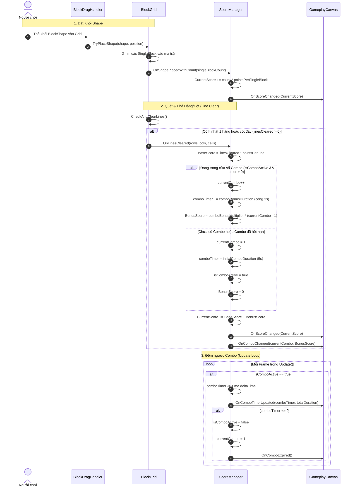

# Thiết Kế Kỹ Thuật: Hệ Thống Tính Điểm & Combo (Score & Combo System) Chuẩn Block Blast

> **Ngày tạo:** 2026-10-04  
> **Tài liệu tham chiếu:** [`.agents/rules/architecture.md`](file:///Users/minhquang/Documents/Unity%20Project/BlockDrag/.agents/rules/architecture.md) & [`.agents/rules/task_planning.md`](file:///Users/minhquang/Documents/Unity%20Project/BlockDrag/.agents/rules/task_planning.md)  
> **Files liên quan:**  
> - [`Assets/_Game/_BlockDrag/Data/ScoreConfigSO.cs`](file:///Users/minhquang/Documents/Unity%20Project/BlockDrag/Assets/_Game/_BlockDrag/Data/ScoreConfigSO.cs) *(mới)*  
> - [`Assets/_Game/_BlockDrag/ScoreManager.cs`](file:///Users/minhquang/Documents/Unity%20Project/BlockDrag/Assets/_Game/_BlockDrag/ScoreManager.cs) *(mới)*  
> - [`Assets/_Game/_BlockDrag/BlockGrid.cs`](file:///Users/minhquang/Documents/Unity%20Project/BlockDrag/Assets/_Game/_BlockDrag/BlockGrid.cs)  
> - [`Assets/_Game/_BlockDrag/BlockSpawner.cs`](file:///Users/minhquang/Documents/Unity%20Project/BlockDrag/Assets/_Game/_BlockDrag/BlockSpawner.cs)  
> - [`Assets/_Game/_UI/Scripts/GameplayCanvas.cs`](file:///Users/minhquang/Documents/Unity%20Project/BlockDrag/Assets/_Game/_UI/Scripts/GameplayCanvas.cs)  
> - [`Assets/_Game/_BlockDrag/GameOverUI.cs`](file:///Users/minhquang/Documents/Unity%20Project/BlockDrag/Assets/_Game/_BlockDrag/GameOverUI.cs)  
> - [`Assets/Tests/EditMode/ScoreSystemTests.cs`](file:///Users/minhquang/Documents/Unity%20Project/BlockDrag/Assets/Tests/EditMode/ScoreSystemTests.cs) *(mới)*  

---

## 1. Yêu Cầu & Bối Cảnh (Requirements & Context)

### 1.1. Mục tiêu từ yêu cầu người dùng
1. **Điểm đặt khối (Shape Placement Score):**
   - Mỗi khi đặt thành công một `BlockShape` xuống bàn cờ (`BlockGrid`), người chơi được cộng số điểm đúng bằng số lượng ô `SingleBlock` cấu thành nên khối đó (ví dụ: khối 4 ô được +4 điểm, khối 9 ô được +9 điểm).
2. **Điểm phá dòng (Line Clear Score):**
   - Mỗi hàng ngang (row) hoặc cột dọc (column) bị phá hủy sẽ cộng cố định **25 điểm** (mặc định cấu hình). Nếu một lượt phá đồng thời $N$ dòng (ví dụ 1 hàng + 1 cột = 2 dòng) thì cộng $N \times 25$ điểm cơ bản.
3. **Cơ chế Combo & Bộ đếm thời gian (Combo Countdown & Time Stacking):**
   - Khi phá hủy hàng/cột lần đầu tiên: kích hoạt Combo cấp 1 và bắt đầu đếm ngược thời gian cửa sổ combo (mặc định **5.0 giây**).
   - Nếu trong thời gian 5s này người chơi tiếp tục phá hủy thêm ít nhất 1 hàng hoặc cột:
     - Cấp độ Combo tăng lên (Combo 2, Combo 3, ...).
     - Thời gian đếm ngược hiện tại được **cộng thêm 3.0 giây** (ví dụ: đang còn 2.5s thì trở thành $2.5s + 3.0s = 5.5s$).
     - Các lần combo tiếp theo cứ thế cộng dồn thêm 3s vào đồng hồ đang đếm.
   - Điểm thưởng khi lên Combo:
     - Bắt đầu từ Combo 2 trở lên: cộng thêm $\text{Điểm Combo} = 25 \times (\text{Combo} - 1)$ điểm.
       - Combo 2: $+ 25 \times (2 - 1) = 25$ điểm.
       - Combo 3: $+ 25 \times (3 - 1) = 50$ điểm.
       - Combo 4: $+ 25 \times (4 - 1) = 75$ điểm.
       - Tổng quát: $+ \text{Multiplier} \times (\text{Combo} - 1)$.
   - Khi hết thời gian đếm ngược (`comboTimer <= 0`): hệ thống tự động **reset cấp Combo về 1** (và tắt trạng thái đếm combo).
4. **Cấu hình động qua ScriptableObject (Configurable SO Data):**
   - Toàn bộ các thông số:
     - Thời gian cửa sổ combo ban đầu (`initialComboDuration = 5s`).
     - Thời gian cộng thêm sau mỗi lần nối combo (`comboBonusDuration = 3s`).
     - Điểm nhân cho mỗi cấp combo (`comboBonusMultiplier = 25`).
     - Điểm cho mỗi SingleBlock đặt xuống (`pointsPerSingleBlock = 1`).
     - Điểm cho mỗi hàng/cột phá hủy (`pointsPerLine = 25`).
     Phải được khai báo trong một `ScriptableObject` để Designer có thể dễ dàng tinh chỉnh trong Inspector của Unity mà không cần sửa code.
5. **Hiển thị giao diện & Lưu trữ High Score:**
   - Cập nhật điểm hiện tại (`ScoreTxt`) và điểm kỷ lục (`HightScoreTxt`) trên `GameplayCanvas`.
   - Lưu trữ HighScore lâu dài (`PlayerPrefs`).
   - Tự động reset điểm về 0 và combo về 1 khi chơi lại ván mới (`OnGameRestarted`).
   - Hiển thị kết quả điểm số trên `GameOverUI` khi thua.

---

## 2. Kiến Trúc & Thiết Kế Thành Phần (Architecture & Component Design)

### 2.1. Phân chia trách nhiệm (Single Responsibility Principle)

```text
┌─────────────────────────────────────────────────────────────┐
│                       ScoreConfigSO                         │
│  - ScriptableObject cấu hình:                               │
│    + pointsPerSingleBlock: 1                                │
│    + pointsPerLine: 25                                      │
│    + initialComboDuration: 5.0s                             │
│    + comboBonusDuration: 3.0s                               │
│    + comboBonusMultiplier: 25                               │
└──────────────────────────────┬──────────────────────────────┘
                               │ inject cấu hình
                               ▼
┌─────────────────────────────────────────────────────────────┐
│                        ScoreManager                         │
│  - Quản lý trạng thái:                                      │
│    + CurrentScore, HighScore                                │
│    + CurrentCombo, ComboTimer, IsComboActive                │
│  - Lắng nghe:                                               │
│    + BlockGrid.OnShapePlacedWithCount (cộng điểm ô đặt)     │
│    + BlockGrid.OnLinesCleared (tính điểm dòng & combo)      │
│    + BlockSpawner.OnGameRestarted (reset điểm & combo)      │
│    + BlockSpawner.OnGameOver (lưu HighScore)                │
│  - Cập nhật Update() đếm ngược ComboTimer                   │
│  - Bắn sự kiện:                                             │
│    + OnScoreChanged, OnHighScoreChanged                     │
│    + OnComboChanged, OnComboTimerUpdated, OnComboExpired    │
└──────────────┬──────────────────────────────┬───────────────┘
               │ bắn sự kiện                  │ bắn sự kiện
               ▼                              ▼
┌──────────────────────────────┐ ┌────────────────────────────┐
│        GameplayCanvas        │ │         GameOverUI         │
│  - Hiển thị CurrentScore     │ │  - Hiển thị điểm số đạt    │
│  - Hiển thị HighScore        │ │    được trong ván chơi     │
│  - Hiệu ứng Punch / Scale    │ │  - Hiển thị Best Score     │
│    khi tăng điểm             │ │                            │
└──────────────────────────────┘ └────────────────────────────┘
```

### 2.2. Chi tiết luồng tính điểm & xử lý Combo



---

## 3. Chi Tiết Các Lớp & Cấu Trúc Dữ Liệu (Class & Data Structures)

### 3.1. `ScoreConfigSO` (ScriptableObject)
- Đường dẫn: `Assets/_Game/_BlockDrag/Data/ScoreConfigSO.cs`
- Menu: `CreateAssetMenu(fileName = "ScoreConfig", menuName = "BlockDrag/Score Config")`
- Các trường cấu hình:
  - `int pointsPerSingleBlock = 1;` (Điểm cộng cho mỗi SingleBlock đặt xuống)
  - `int pointsPerLine = 25;` (Điểm cộng cho mỗi hàng/cột bị phá hủy)
  - `float initialComboDuration = 5f;` (Thời gian cửa sổ combo ban đầu - 5s)
  - `float comboBonusDuration = 3f;` (Thời gian cộng thêm mỗi lần nối tiếp combo - 3s)
  - `int comboBonusMultiplier = 25;` (Hệ số điểm nhân với `(combo - 1)`)

### 3.2. `ScoreManager` (MonoBehaviour / Singleton)
- Quản lý trạng thái điểm và combo tập trung:
  - `int CurrentScore { get; }`
  - `int HighScore { get; }`
  - `int CurrentCombo { get; }`
  - `float ComboTimer { get; }`
  - `bool IsComboActive { get; }`
- Phương thức chính:
  - `void AddPlacementScore(int singleBlockCount)`
  - `void HandleLinesCleared(int rowsCount, int colsCount, int totalCells)`
  - `void UpdateComboTimer(float deltaTime)`
  - `void ResetScoreAndCombo()`
  - `void SaveHighScore()`
- Đảm bảo tính linh hoạt: nếu thiếu `ScoreConfigSO` gán trên Inspector, tự động sinh instance mặc định với đúng các giá trị theo đặc tả người dùng.

### 3.3. Tích hợp `BlockGrid.cs`
- Thêm event chi tiết: `public event System.Action<int> OnShapePlacedWithCount;`
- Giữ nguyên `public event System.Action OnShapePlaced;` để tương thích 100% với `BlockSpawner`.
- Trong `TryPlaceShape`: tính số lượng single block trước khi hủy `shape.gameObject`, sau đó gọi `OnShapePlacedWithCount?.Invoke(singleBlockCount)`.

### 3.4. Tích hợp `GameplayCanvas.cs`
- Lắng nghe `ScoreManager.OnScoreChanged` và `ScoreManager.OnHighScoreChanged`.
- Cập nhật trực tiếp `ScoreTxt` và `HightScoreTxt`.
- Thêm hiệu ứng Punch Scale / Tween tăng số nhẹ nhàng để UI sinh động, chuyên nghiệp.

### 3.5. Tích hợp `GameOverUI.cs`
- Hiển thị điểm số ván chơi vừa kết thúc và điểm kỷ lục trên bảng thông báo Game Over.

---

## 4. Kịch Bản Kiểm Thử & Xác Minh (Verification Strategy)
1. **Kiểm thử tự động (Unit Tests - EditMode):**
   - `AddPlacementScore_AddsCorrectPoints`: Đặt shape 4 block $\rightarrow$ score tăng 4.
   - `ClearSingleLine_NoActiveCombo_Awards25PointsAndStarts5sTimer`: Phá 1 hàng $\rightarrow +25$ điểm, combo = 1, timer = 5s.
   - `ClearLineWithinWindow_IncreasesComboAndAdds3s`: Phá tiếp trong 5s $\rightarrow$ combo = 2, timer cộng thêm 3s, cộng thêm $25 \times (2 - 1) = 25$ điểm combo.
   - `ClearLineAtCombo3_Awards50BonusPoints`: Phá tiếp lần 3 $\rightarrow$ combo = 3, cộng thêm $25 \times (3 - 1) = 50$ điểm combo.
   - `ComboTimerExpires_ResetsComboToOne`: Đếm ngược hết 5s $\rightarrow$ combo reset về 1, timer về 0.
   - `RestartGame_ResetsCurrentScoreAndCombo`: Khởi động lại ván $\rightarrow$ score về 0, combo về 1, giữ nguyên HighScore.
2. **Kiểm thử trực quan trong Unity Editor:**
   - Kéo thả các khối shape lên grid, quan sát số điểm tăng tương ứng.
   - Xếp đầy hàng/cột, quan sát điểm số cộng 25 điểm.
   - Nhanh tay phá tiếp hàng/cột thứ 2 trong 5s, kiểm tra điểm combo tăng và thời gian được cộng thêm 3s.
   - Để quá thời gian 5s, kiểm tra combo tự reset về 1.
