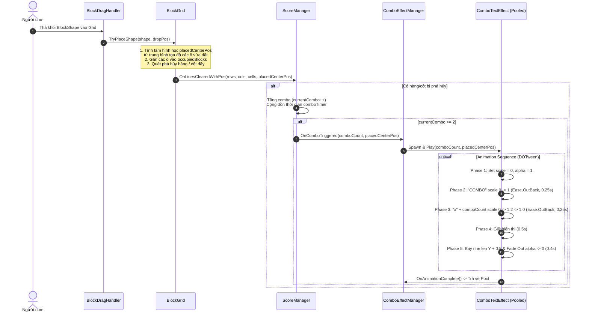

# Thiết Kế Kỹ Thuật: Hiệu Ứng Hoạt Họa Text Combo (Combo Text Animation FX)

> **Ngày tạo:** 2026-10-04  
> **Tài liệu tham chiếu:** [`.agents/rules/architecture.md`](file:///Users/minhquang/Documents/Unity%20Project/BlockDrag/.agents/rules/architecture.md) & [`.agents/rules/task_planning.md`](file:///Users/minhquang/Documents/Unity%20Project/BlockDrag/.agents/rules/task_planning.md)  
> **Files liên quan:**  
> - [`Assets/_Game/_BlockDrag/BlockGrid.cs`](file:///Users/minhquang/Documents/Unity%20Project/BlockDrag/Assets/_Game/_BlockDrag/BlockGrid.cs)  
> - [`Assets/_Game/_BlockDrag/ScoreManager.cs`](file:///Users/minhquang/Documents/Unity%20Project/BlockDrag/Assets/_Game/_BlockDrag/ScoreManager.cs)  
> - [`Assets/_Game/_BlockDrag/Effects/ComboTextEffect.cs`](file:///Users/minhquang/Documents/Unity%20Project/BlockDrag/Assets/_Game/_BlockDrag/Effects/ComboTextEffect.cs) *(mới)*  
> - [`Assets/_Game/_BlockDrag/Effects/ComboEffectManager.cs`](file:///Users/minhquang/Documents/Unity%20Project/BlockDrag/Assets/_Game/_BlockDrag/Effects/ComboEffectManager.cs) *(mới)*  
> - [`Assets/Tests/EditMode/ComboEffectTests.cs`](file:///Users/minhquang/Documents/Unity%20Project/BlockDrag/Assets/Tests/EditMode/ComboEffectTests.cs) *(mới)*  

---

## 1. Yêu Cầu & Bối Cảnh (Requirements & Context)

### 1.1. Mục tiêu từ yêu cầu người dùng
1. **Thông báo Text Combo:**
   - Khi người chơi thực hiện Combo (phá hàng/cột liên tiếp trong thời gian đếm ngược combo), game sẽ xuất hiện text thông báo cấp độ combo hiện tại (ví dụ: `"COMBO x2"`, `"COMBO x3"`).
   - Ngưỡng kích hoạt: Bắt đầu xuất hiện từ **Combo 2 trở lên**.
2. **Vị trí xuất hiện:**
   - Xuất hiện tại **tâm hình học của khối `BlockShape`** vừa đặt xuống bàn cờ để kích hoạt chuỗi phá hàng/cột đó (tính từ trung bình tọa độ World của các ô cell mà khối chiếm).
3. **Hiệu ứng hoạt họa (Animation Sequence):**
   - Bố cục: Cùng 1 dòng ngang, gồm nhãn chữ `"COMBO"` và số combo (ví dụ: `"x2"`).
   - Thứ tự xuất hiện:
     - Chữ `"COMBO"` scale từ `0` lên `1` trước (`Ease.OutBack`, 0.25s).
     - Ngay sau đó số combo (vd: `"x2"`) scale nảy từ `0` lên `1.2 -> 1.0` (`Ease.OutBack`, 0.25s).
   - Sau khi hoàn thành xuất hiện:
     - Dừng hiển thị khoảng `0.5s`.
     - Bay nhẹ lên trên (khoảng `+0.8` đơn vị trục Y) kết hợp hiệu ứng Fade Out (mờ dần về 0 trong `0.4s`) rồi biến mất.
   - Quản lý bộ nhớ: Tái sử dụng qua Object Pool để không phát sinh Garbage Collection (GC Alloc) trong quá trình chơi liên tục.

---

## 2. Kiến Trúc & Thiết Kế Thành Phần (Architecture & Component Design)

### 2.1. Phân chia trách nhiệm

```text
┌─────────────────────────────────────────────────────────────┐
│                          BlockGrid                          │
│  - TryPlaceShape():                                         │
│    + Tính tâm placedCenterPos từ trung bình tọa độ các ô    │
│    + Gán occupiedBlocks & CheckAndClearLines()              │
│  - Bắn sự kiện:                                             │
│    + OnLinesCleared(rows, cols, cells)                      │
│    + OnLinesClearedWithPos(rows, cols, cells, centerPos)    │
└──────────────────────────────┬──────────────────────────────┘
                               │
                               ▼
┌─────────────────────────────────────────────────────────────┐
│                        ScoreManager                         │
│  - Lắng nghe OnLinesClearedWithPos                          │
│  - Tăng currentCombo & đếm ngược comboTimer                 │
│  - Bắn sự kiện:                                             │
│    + OnComboTriggered(comboCount, centerPos) khi combo >= 2 │
└──────────────────────────────┬──────────────────────────────┘
                               │
                               ▼
┌─────────────────────────────────────────────────────────────┐
│                     ComboEffectManager                      │
│  - Quản lý Object Pool (danh sách ComboTextEffect)          │
│  - Lắng nghe ScoreManager.OnComboTriggered                  │
│  - Spawn effect tại centerPos và gọi Play(comboCount)       │
└──────────────────────────────┬──────────────────────────────┘
                               │
                               ▼
┌─────────────────────────────────────────────────────────────┐
│                       ComboTextEffect                       │
│  - 2 TextMeshPro con: comboLabel ("COMBO") & comboNumber    │
│  - Quản lý DOTween Sequence:                                │
│    + Reset: scale = 0, alpha = 1                            │
│    + Step 1: comboLabel scale 0 -> 1 (Ease.OutBack)         │
│    + Step 2: comboNumber scale 0 -> 1.2 -> 1.0              │
│    + Step 3: Delay 0.5s                                     │
│    + Step 4: DOMoveY (+0.8f) & DOFade (0f)                  │
│    + Step 5: OnComplete -> Deactivate / Return to Pool      │
└─────────────────────────────────────────────────────────────┘
```

---

### 2.2. Sơ đồ tuần tự (Sequence Diagram)



---

## 3. Đặc Tả Chi Tiết Từng Lớp (Detailed Class Specification)

### 3.1. `BlockGrid` (Mở rộng tính toán tâm khối đặt)
- Thêm trường lưu trữ:
  ```csharp
  public Vector3 LastPlacedCenterPosition { get; private set; }
  public event System.Action<int, int, int, Vector3> OnLinesClearedWithPos;
  ```
- Trong `TryPlaceShape`:
  ```csharp
  Vector3 totalCellPos = Vector3.zero;
  int count = 0;
  for (int r = 0; r < rows; r++)
  {
      for (int c = 0; c < cols; c++)
      {
          if (shape.HasBlockAt(r, c))
          {
              int targetR = baseCoord.x + r;
              int targetC = baseCoord.y + c;
              totalCellPos += GetCellWorldPosition(targetR, targetC);
              count++;
              // ... đặt khối vào occupiedBlocks
          }
      }
  }
  LastPlacedCenterPosition = count > 0 ? (totalCellPos / count) : shapeWorldPos;
  ```
- Khi `CheckAndClearLines()` hoàn thành và có dòng nổ:
  ```csharp
  OnLinesCleared?.Invoke(fullRows.Count, fullCols.Count, cellsToClear.Count);
  OnLinesClearedWithPos?.Invoke(fullRows.Count, fullCols.Count, cellsToClear.Count, LastPlacedCenterPosition);
  ```

### 3.2. `ScoreManager` (Bắn sự kiện Combo kèm toạ độ)
- Khai báo sự kiện mới:
  ```csharp
  public event Action<int, Vector3> OnComboTriggered; // (comboCount, worldPos)
  ```
- Lắng nghe `blockGrid.OnLinesClearedWithPos`:
  ```csharp
  public void HandleLinesClearedWithPos(int rowsCleared, int colsCleared, int totalCellsCleared, Vector3 placedPos)
  {
      HandleLinesCleared(rowsCleared, colsCleared, totalCellsCleared);
      if (currentCombo >= 2)
      {
          OnComboTriggered?.Invoke(currentCombo, placedPos);
      }
  }
  ```

### 3.3. `ComboTextEffect` (Prefab & DOTween Sequence)
- Thuộc tính cấu hình qua Inspector:
  - `[SerializeField] private TMP_Text comboLabelText;` (Chứa chữ `"COMBO"`, màu vàng gradient/outline cam).
  - `[SerializeField] private TMP_Text comboNumberText;` (Chứa `"x2"`, màu trắng/vàng sáng, outline dày).
  - `[SerializeField] private Transform labelContainer;`
  - `[SerializeField] private Transform numberContainer;`
  - `[SerializeField] private float labelScaleDuration = 0.25f;`
  - `[SerializeField] private float numberScaleDuration = 0.25f;`
  - `[SerializeField] private float stayDuration = 0.5f;`
  - `[SerializeField] private float floatUpDistance = 0.8f;`
  - `[SerializeField] private float fadeOutDuration = 0.4f;`
- Hàm phát hoạt họa:
  ```csharp
  public void Play(int comboCount, Action onComplete = null)
  ```
- Tự động hủy Sequence cũ (`sequence?.Kill()`) khi gọi `Play` mới hoặc khi `OnDisable`.

### 3.4. `ComboEffectManager` (Pooling & Coordination)
- `[SerializeField] private ComboTextEffect effectPrefab;`
- `[SerializeField] private int initialPoolSize = 5;`
- Quản lý `List<ComboTextEffect> pool`:
  - Lấy instance chưa active hoặc Instantiate mới nếu thiếu.
  - Đăng ký `ScoreManager.Ins.OnComboTriggered` trong `OnEnable`, hủy đăng ký trong `OnDisable`.
  - Tự động reset và tái sử dụng khi hoạt họa hoàn thành.

---

## 4. Kế Hoạch Kiểm Thử & Tiêu Chí Nghiệm Thu (Verification Criteria)

1. **Unit / EditMode Tests (`ComboEffectTests.cs`):**
   - Kiểm tra `BlockGrid` tính đúng tâm `LastPlacedCenterPosition` cho các khối shape khác nhau (1x1, 2x2, hình L).
   - Kiểm tra `ScoreManager.OnComboTriggered` được gọi đúng khi `currentCombo >= 2` và không gọi khi `currentCombo == 1`.
   - Kiểm tra toạ độ truyền vào `OnComboTriggered` khớp với `placedPos`.
2. **PlayMode / Visual Check trong Unity:**
   - Kéo đặt khối gây nổ dòng lần 1: không hiện text combo.
   - Nối tiếp đặt khối gây nổ dòng lần 2 trong 5s: Text `"COMBO x2"` xuất hiện đúng ngay tâm khối vừa thả.
   - Chữ `"COMBO"` nảy to ra trước, ngay sau đó chữ `"x2"` nảy to ra bên cạnh.
   - Dừng lại 0.5s rồi trôi lên trên và mờ dần biến mất mượt mà.
