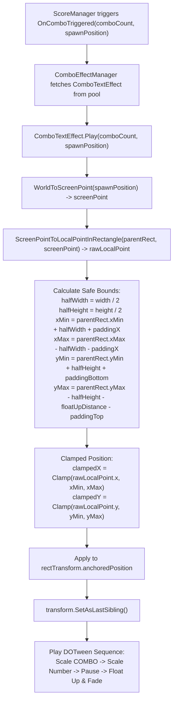

# Combo Text Screen Boundary Clamping Design

**Date:** 2026-10-05  
**Feature:** Căn chỉnh toạ độ Combo Text Effect tránh bị khuất ở mép màn hình / camera  
**Target Module:** `Hung.UI` (`ComboTextEffect.cs`)

---

## 1. Problem Analysis & Requirements

### Current Problem
- [ComboTextEffect](file:///Users/minhquang/Documents/Unity%20Project/BlockDrag/Assets/_Game/_UI/Scripts/ComboTextEffect.cs) lấy tâm hình học của khối `BlockShape` vừa đặt (`spawnPosition`) rồi chiếu thẳng lên Canvas (`anchoredPosition = localPoint`).
- Khung UI của Combo Text có kích thước `400 x 100` (nửa chiều rộng = `200px`, nửa chiều cao = `50px`), đồng thời trong hoạt họa còn bay lên trên thêm `floatUpDistance = 75px`.
- **Hệ quả khi đặt ở các vị trí biên:**
  - **Biên trái (cột 0):** Chữ "COMBO" lồi ra 200px về bên trái, dễ bị cắt cụt (clipping) bởi mép trái màn hình/camera.
  - **Biên phải (cột 7):** Số combo "x2", "x3" lồi ra 200px về bên phải, bị cắt cụt bởi mép phải màn hình.
  - **Biên trên (hàng 0, 1):** Khối đặt ở các hàng trên cùng cộng thêm quãng đường trôi lên `+75px` sẽ bay vào khu vực header điểm số/kỷ lục hoặc tràn khỏi mép trên của màn hình.

### Solution Requirements
1. Sau khi chuyển đổi toạ độ từ thế giới `spawnPosition` sang toạ độ Canvas `localPoint`, tiến hành **Clamping (giới hạn vùng an toàn - Safe Screen Bounds)**.
2. Vùng an toàn được xác định theo kích thước thực tế của Canvas cha (`parentRect.rect`) cùng với kích thước của chính `ComboTextEffect`:
   - $X_{\min} = \text{parentRect.rect.xMin} + \text{halfWidth} + \text{horizontalPadding}$
   - $X_{\max} = \text{parentRect.rect.xMax} - \text{halfWidth} - \text{horizontalPadding}$
   - $Y_{\min} = \text{parentRect.rect.yMin} + \text{halfHeight} + \text{bottomPadding}$
   - $Y_{\max} = \text{parentRect.rect.yMax} - \text{halfHeight} - \text{floatUpDistance} - \text{topPadding}$
3. Nếu vị trí tính toán ban đầu nằm ngoài khoảng an toàn, toạ độ tự động được ép vào trong giới hạn để toàn bộ chữ COMBO và số combo luôn hiển thị trọn vẹn 100% trong khung nhìn.

---

## 2. Visual Workflow Diagram

---

## 3. Boundary Formulas & Edge Cases

| Trường hợp đặt khối | Vị trí ban đầu | Vấn đề | Kết quả sau Clamp |
|---|---|---|---|
| **Cột 0 (mép trái)** | `localPoint.x < xMin` | Bị khuất chữ `"COM"` của `"COMBO"` | Đẩy sang phải vừa đủ `xMin`, chữ hiển thị trọn vẹn cách mép trái `paddingX` |
| **Cột 7 (mép phải)** | `localPoint.x > xMax` | Bị khuất số `"x2"` / `"x3"` | Kéo sang trái vừa đủ `xMax`, chữ hiển thị trọn vẹn cách mép phải `paddingX` |
| **Hàng 0 (mép trên)** | `localPoint.y > yMax` | Bay lẹm vào Top Header hoặc mép trên | Giữ vị trí $Y$ dưới mức an toàn để khi bay lên $+75$px vẫn nằm dưới Header |
| **Kích thước màn hình hẹp** | `xMin > xMax` | Màn hình quá hẹp | Lấy trung điểm `(xMin + xMax) / 2` |

---

## 4. Impacted Files
- [Assets/_Game/_UI/Scripts/ComboTextEffect.cs](file:///Users/minhquang/Documents/Unity%20Project/BlockDrag/Assets/_Game/_UI/Scripts/ComboTextEffect.cs): Thêm cấu hình padding an toàn và logic clamp toạ độ trong hàm `Play()` (hoặc hàm tính toạ độ `CalculateClampedUIPosition()`).
- [Assets/Tests/EditMode/ComboEffectTests.cs](file:///Users/minhquang/Documents/Unity%20Project/BlockDrag/Assets/Tests/EditMode/ComboEffectTests.cs): Bổ sung Unit Test kiểm tra toạ độ được clamp chính xác khi truyền vị trí ở cực trái, cực phải và cực trên.
