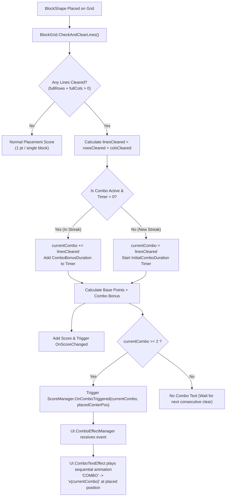

# Multi-Line Clear Combo Accumulation System Design

**Date:** 2026-10-05  
**Feature:** Multi-Line Clear Combo Accumulation Logic (Tích lũy Combo theo số hàng/cột phá hủy)  
**Target Module:** `Gameplay.BlockDrag` (`ScoreManager.cs`) & `UI` (`ComboEffectManager`, `ComboTextEffect`)

---

## 1. Requirements & Intent

### Current Behavior
- Hiện tại, mỗi lần phá hủy hàng/cột (dù là 1 dòng hay 4 dòng cùng lúc), combo chỉ tăng thêm 1 (`currentCombo++` hoặc bắt đầu với `currentCombo = 1`).
- Nếu nước đi đầu tiên phá 2 hoặc 3 hàng/cột cùng lúc, người chơi vẫn chỉ nhận được `Combo 1` và không kích hoạt Text hiệu ứng Combo UI (vì điều kiện kích hoạt là `currentCombo >= 2`).

### New Target Behavior
1. **Phá hủy 1 hàng/cột**: Tính là 1 combo (`currentCombo += 1`).
2. **Phá hủy nhiều hàng/cột trong 1 lần đặt (Multi-line Clear)**:
   - Cộng dồn số combo bằng đúng số hàng + cột bị phá hủy trong lần đặt đó:
     $$\Delta \text{Combo} = \text{linesCleared} = \text{rowsCleared} + \text{colsCleared}$$
   - **Khi bắt đầu chuỗi mới (chưa có combo / combo đã hết hạn)**:
     - Phá 1 dòng $\rightarrow$ `currentCombo = 1` (chưa hiện Text Combo, bắt đầu đếm ngược 5s).
     - Phá 2 dòng cùng lúc $\rightarrow$ `currentCombo = 2` (kích hoạt ngay hiệu ứng `COMBO x2` tại vị trí đặt khối, bắt đầu đếm ngược 5s).
     - Phá 3 dòng cùng lúc $\rightarrow$ `currentCombo = 3` (kích hoạt ngay hiệu ứng `COMBO x3`).
   - **Khi đang trong chuỗi combo (combo active & timer > 0)**:
     - Đang ở Combo $C$, phá thêm $L$ dòng $\rightarrow$ Cấp combo mới:
       $$\text{currentCombo}_{\text{new}} = C + L$$
     - Ví dụ: Đang ở Combo 1, nước đi tiếp theo ăn 2 dòng $\rightarrow$ lên thẳng `Combo 3` (`x3`)!
     - Ví dụ: Đang ở Combo 2, ăn tiếp 2 dòng $\rightarrow$ lên `Combo 4` (`x4`).
3. **Tính điểm thưởng Combo (Combo Bonus Score)**:
   - Điểm cơ bản: $\text{linesCleared} \times \text{PointsPerLine}$ ($25$ điểm/dòng).
   - Điểm thưởng combo: $(\text{currentCombo} - 1) \times \text{ComboBonusMultiplier}$ ($25$ điểm $\times (\text{combo} - 1)$).
   - Khi phá nhiều dòng ở chuỗi mới (ví dụ 2 dòng), người chơi cũng nhận được điểm combo thưởng của Combo 2.

---

## 2. Architecture & Workflow Diagram

---

## 3. Mathematical & Logical Examples

| Lượt đi | Trạng thái trước | Số hàng/cột phá | Cấp Combo mới | Điểm dòng (25đ/dòng) | Điểm thưởng Combo (25đ x (Combo-1)) | Hiển thị Text UI |
|---|---|---|---|---|---|---|
| Lượt 1 | Chưa có combo | 1 dòng | **Combo 1** | 25 | 0 | Không hiện (Combo 1) |
| Lượt 2 | Đang Combo 1 (còn giờ) | 1 dòng | **Combo 2** ($1+1$) | 25 | 25 | `COMBO x2` |
| Lượt 3 | Đang Combo 2 (còn giờ) | 2 dòng | **Combo 4** ($2+2$) | 50 | 75 | `COMBO x4` |
| Lượt 4 | Hết giờ combo (về 1) | 2 dòng cùng lúc | **Combo 2** (0+2) | 50 | 25 | `COMBO x2` |
| Lượt 5 | Đang Combo 2 (còn giờ) | 3 dòng cùng lúc | **Combo 5** ($2+3$) | 75 | 100 | `COMBO x5` |

---

## 4. Impacted Files
- `Assets/_Game/_BlockDrag/ScoreManager.cs`: Cập nhật logic `HandleLinesCleared()` để cộng dồn `linesCleared` thay vì chỉ `currentCombo++`.
- `Assets/Tests/EditMode/ScoreSystemTests.cs`: Bổ sung các unit test kiểm thử logic tích lũy combo cho cả trường hợp 1 dòng và nhiều dòng (multi-line).
