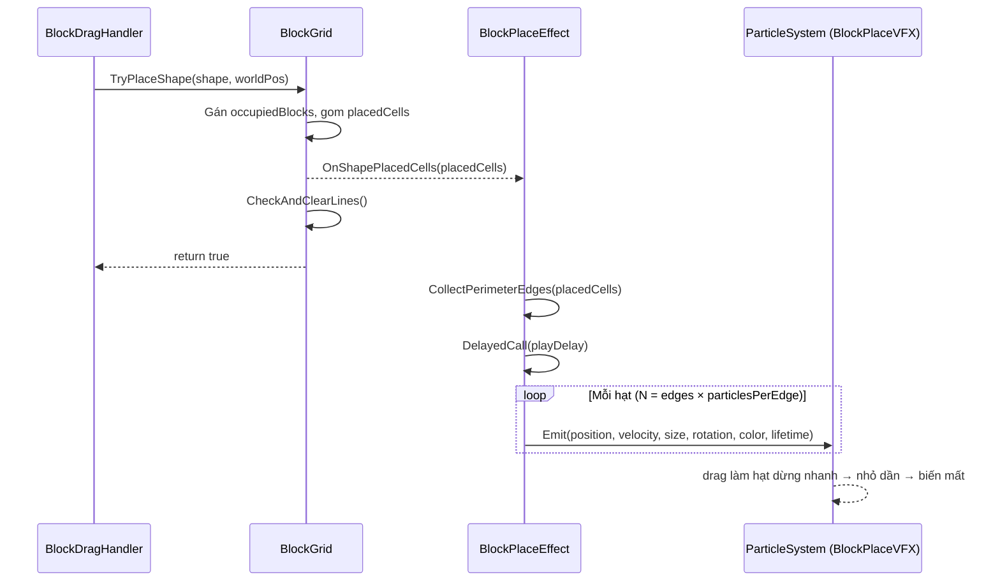
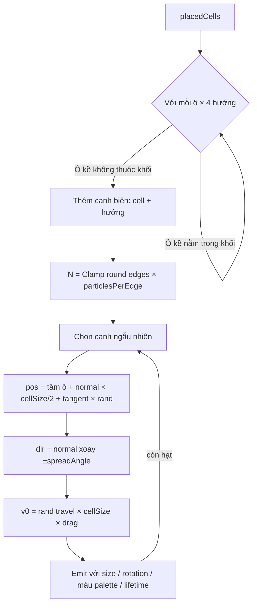
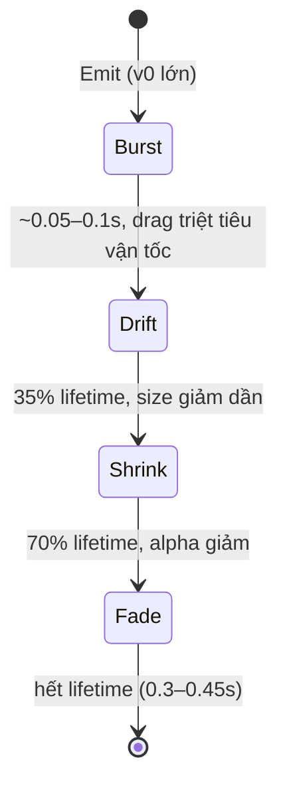

# Thiết Kế Kỹ Thuật: Hiệu Ứng Particle Tỏa Khi Đặt BlockShape (Block Place Burst FX)

> **Ngày tạo:** 2026-10-06
> **Tài liệu tham chiếu:** `.agents/rules/architecture.md`, `.agents/rules/task_planning.md`
> **Video tham chiếu:** `Assets/_Game/_BlockDrag/Resource/1791219122143_2226600900546722489_9065635962486239376.mp4`
> **Files liên quan:**
> - `Assets/_Game/_BlockDrag/BlockGrid.cs` *(sửa — thêm event)*
> - `Assets/_Game/_BlockDrag/Effects/BlockPlaceEffect.cs` *(mới)*
> - `Assets/Tests/EditMode/BlockPlaceEffectTests.cs` *(mới)*

---

## 1. Yêu Cầu & Phân Tích Video

### 1.1. Mục tiêu
Khi người chơi thả một `BlockShape` hợp lệ xuống `BlockGrid`, phát một hiệu ứng particle nhỏ "tỏa" ra xung quanh khối giống Block Blast.

### 1.2. Phân tích từng khung hình (video 2.5s, 24 fps, mỗi frame ≈ 0.042s)

| Thời điểm | Quan sát |
|---|---|
| 0.29s | Khối cam (hình S, 4 ô) đang được kéo, có ghost indicator bên dưới |
| 0.33s | Khối snap vào lưới, **không** có particle |
| 0.33s → 0.54s | Khối nằm yên, chưa có particle (độ trễ ≈ 0.2s) |
| 0.58s | **Toàn bộ particle xuất hiện cùng lúc** và đã ở vị trí tỏa xa 0.3–1.5 ô tính từ mép khối → vận tốc ban đầu rất lớn, tắt dần gần như tức thì |
| 0.58s → 0.75s | Particle gần như đứng yên, trôi rất chậm, **nhỏ dần** |
| 0.79s → 0.92s | Particle chỉ còn chấm nhỏ rồi biến mất (lifetime ≈ 0.3–0.45s) |

**Đặc điểm hạt:**
- Hình **vuông nhỏ**, xoay ngẫu nhiên (một số trông như hình thoi).
- Kích thước ≈ **10–18% cạnh ô**.
- Số lượng ≈ **12–16 hạt** cho khối 4 ô (≈ 1.3 hạt / cạnh biên).
- **Nhiều màu ngẫu nhiên**, không theo màu khối: xanh lá, đỏ, cam, vàng, vàng nhạt, cyan, tím.
- Phân bố **quanh chu vi khối** theo mọi hướng, kể cả tràn ra ngoài viền board.
- Hạt được vẽ **dưới các block đã đặt** (một hạt cam bị block che nửa) nhưng trên ô nền.

---

## 2. Kiến Trúc & Thiết Kế Thành Phần

### 2.1. Phân lớp
- `BlockPlaceEffect` thuộc tầng **Feature/Gameplay** (`BlockDrag.asmdef`, namespace `Gameplay.BlockDrag`), cùng module với `BlockGrid`. Không thêm phụ thuộc mới giữa các assembly.
- `BlockGrid` chỉ **phát sự kiện** (không biết gì về VFX) → giữ đúng hướng phụ thuộc: VFX lắng nghe gameplay, gameplay không gọi VFX.

### 2.2. Thay đổi trong `BlockGrid`
```csharp
// (cellsCoords) danh sách toạ độ (row, col) các ô vừa được khối chiếm
public event System.Action<IReadOnlyList<Vector2Int>> OnShapePlacedCells;
```
Phát ngay sau khi gán `occupiedBlocks` và **trước** `CheckAndClearLines()` để vị trí ô luôn hợp lệ.

### 2.3. `BlockPlaceEffect` (MonoBehaviour mới)
- Tự sinh **một** `ParticleSystem` duy nhất bằng code (không cần prefab/material asset), mỗi lần đặt khối gọi `ParticleSystem.Emit(EmitParams)` cho từng hạt → không Instantiate, không pool, không GC trong gameplay.
- GameObject chứa ParticleSystem là **root riêng** (`BlockPlaceVFX`), không làm con của `BlockGrid` vì `BlockGrid.ClearGrid()` destroy toàn bộ child.
- Thuật toán phát hạt:
  1. `CollectPerimeterEdges(cells)` (static, thuần logic, test được): với mỗi ô, xét 4 hướng; cạnh nào có ô kề **không thuộc khối** là cạnh biên. Lưu ý trong grid hàng tăng xuống dưới, nên hướng "lên" là `row - 1` ↔ `+Y` world.
  2. Số hạt = `Clamp(round(edgeCount × particlesPerEdge), minParticles, maxParticles)`.
  3. Mỗi hạt: chọn ngẫu nhiên 1 cạnh biên → vị trí = tâm cạnh + tiếp tuyến × `Random(-0.5, 0.5) × cellSize`.
  4. Hướng bay = pháp tuyến ngoài của cạnh xoay ngẫu nhiên `±spreadAngle`.
  5. Quãng bay mong muốn `d ∈ [minTravel, maxTravel] × cellSize`; với lực cản tuyến tính `k` (`LimitVelocityOverLifetime.drag`), vận tốc đầu `v0 = d × k` → hạt dừng ở đúng khoảng cách `d` (x(t) = v0/k · (1 − e^(−kt))).
  6. Size, xoay, màu (palette), lifetime ngẫu nhiên trong khoảng.
- Module ParticleSystem:
  - `Main`: không loop, `simulationSpace = World`, `playOnAwake = false`, `maxParticles = 256`.
  - `Emission`: tắt (chỉ dùng `Emit` thủ công).
  - `LimitVelocityOverLifetime`: `drag = k` (mặc định 22), `multiplyDragByParticleSize = false`.
  - `SizeOverLifetime`: curve 1 → 1 (35% đầu) → 0.
  - `ColorOverLifetime`: alpha 1 → 1 (70%) → 0.
  - `Renderer`: Billboard, material `Sprites/Default` (texture trắng → hạt vuông), `sortingOrder = 1` (trên ô nền 0, dưới block đã đặt 2).
- `playDelay` (mặc định 0.2s giống video) chạy bằng `DOVirtual.DelayedCall`. Đặt `0` để phát ngay.

### 2.4. Tham số Inspector (mặc định khớp video)

| Tham số | Mặc định | Ý nghĩa |
|---|---|---|
| `playDelay` | 0.2 | Trễ sau khi đặt khối (giây) |
| `particlesPerEdge` | 1.3 | Mật độ hạt theo số cạnh biên |
| `minParticles` / `maxParticles` | 6 / 36 | Giới hạn số hạt mỗi lần |
| `sizeRange` | 0.10 – 0.18 | Kích thước hạt (× cellSize) |
| `travelRange` | 0.25 – 1.3 | Quãng bay (× cellSize) |
| `spreadAngle` | 40° | Độ lệch hướng so với pháp tuyến |
| `drag` | 22 | Lực cản (càng lớn càng "bung rồi dừng" nhanh) |
| `lifetimeRange` | 0.3 – 0.45 | Thời gian sống (giây) |
| `palette` | 7 màu | Xanh lá, đỏ, cam, vàng, vàng nhạt, cyan, tím |
| `sortingOrder` | 1 | Thứ tự vẽ của hạt |

---

## 3. Sơ Đồ

### 3.1. Luồng sự kiện



### 3.2. Thuật toán phát hạt



### 3.3. Vòng đời một hạt



---

## 4. Rủi Ro & Ghi Chú
- `Shader.Find("Sprites/Default")` luôn có trong build vì SpriteRenderer dùng nó. Có thể gán `materialOverride` trong Inspector nếu muốn dùng material riêng (ví dụ AllIn1 glow).
- Nếu board có sprite viền với `sortingOrder ≥ 1`, hạt tràn ra ngoài viền có thể bị che. Khi đó chỉnh `sortingOrder` trong Inspector.
- Không phát hiệu ứng khi `TryPlaceShape` thất bại (event chỉ bắn khi đặt thành công).
