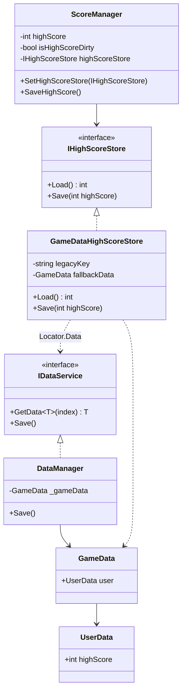
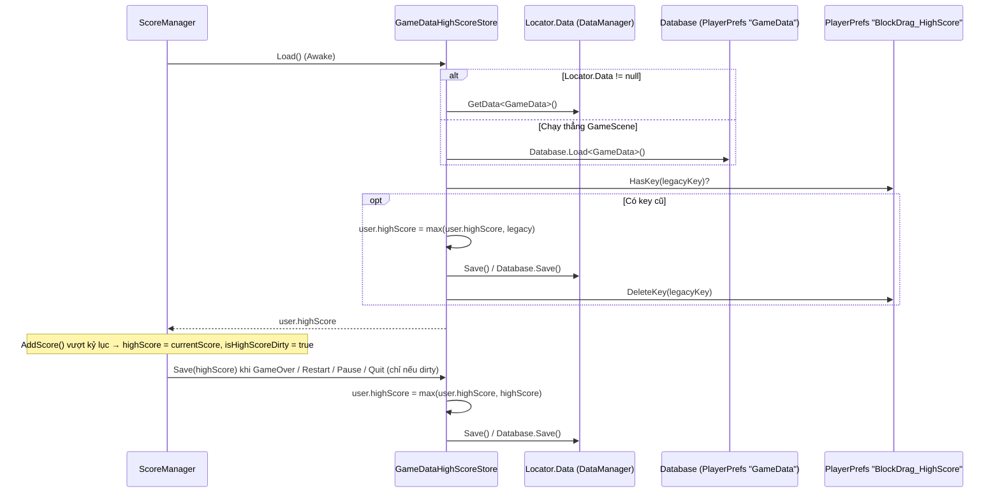
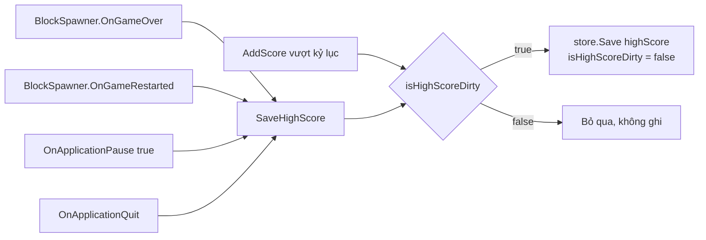
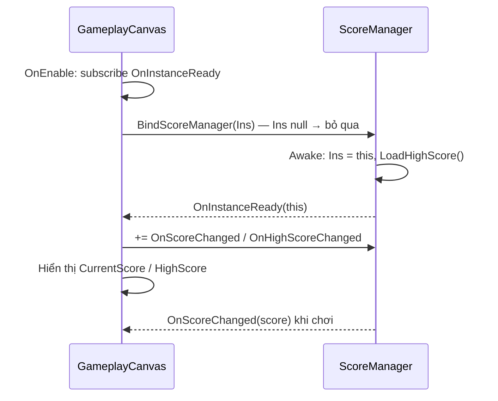

# Thiết Kế Kỹ Thuật: Lưu High Score qua DataManager (GameData)

> **Ngày tạo:** 2026-10-10  
> **Tài liệu tham chiếu:** [`.agents/rules/architecture.md`](../../.agents/rules/architecture.md), [`2026-10-04-block-blast-score-and-combo-system-design.md`](2026-10-04-block-blast-score-and-combo-system-design.md)  
> **Files liên quan:**  
> - [`Assets/_Game/_Base/GameData.cs`](../../Assets/_Game/_Base/GameData.cs)  
> - [`Assets/_Game/_BlockDrag/ScoreManager.cs`](../../Assets/_Game/_BlockDrag/ScoreManager.cs)  
> - `Assets/_Game/_BlockDrag/IHighScoreStore.cs` *(mới)*  
> - `Assets/_Game/_BlockDrag/GameDataHighScoreStore.cs` *(mới)*  
> - [`Assets/Tests/EditMode/ScoreSystemTests.cs`](../../Assets/Tests/EditMode/ScoreSystemTests.cs)  

---

## 1. Bối Cảnh & Yêu Cầu

### 1.1. Hiện trạng
- `ScoreManager` đọc/ghi high score trực tiếp bằng `PlayerPrefs` (key `BlockDrag_HighScore`), **không** đi qua `DataManager` / `GameData`. Điều này trái quy tắc kiến trúc: *"mutable player state in `GameData`"*.
- High score chỉ được ghi khi `BlockSpawner.OnGameOver`. Nếu người chơi phá kỷ lục rồi thoát app / app bị kill giữa ván, kỷ lục bị mất.
- `DataManager` chỉ có trong prefab được đặt ở scene `LoadStart`. Khi chạy thẳng `GameScene` trong Editor, `Locator.Data` là `null`.

### 1.2. Mục tiêu
1. High score là một trường của `GameData.UserData` và được lưu qua `IDataService.Save()` (`Locator.Data`).
2. Người chơi cũ **không mất kỷ lục**: giá trị trong key `PlayerPrefs` cũ được chuyển sang `GameData` một lần rồi xoá key cũ.
3. Lưu thêm khi app bị pause/quit và khi restart ván, chỉ ghi khi giá trị thực sự thay đổi (dirty flag).
4. `ScoreManager` vẫn test được trong EditMode mà không đụng dữ liệu thật của người chơi.
5. Chạy thẳng `GameScene` (không có `DataManager`) vẫn lưu đúng vào cùng chỗ (`Database` → key `GameData`).

### 1.3. Ngoài phạm vi
- Không đổi công thức tính điểm/combo.
- Không đổi UI (`GameplayCanvas`, `GameOverUI`) — vẫn đọc `ScoreManager.HighScore` và nghe `OnHighScoreChanged`.

---

## 2. Thiết Kế

### 2.1. Thành phần

| Thành phần | Assembly | Trách nhiệm |
| :--- | :--- | :--- |
| `GameData.UserData.highScore` | `Hung.Base` | Trạng thái người chơi được serialize bằng Newtonsoft (`Database`). Thiếu trường trong JSON cũ → mặc định `0`. |
| `IHighScoreStore` | `BlockDrag` | Contract nhỏ: `int Load()`, `void Save(int highScore)`. Cho phép inject fake trong test. |
| `GameDataHighScoreStore` | `BlockDrag` | Implementation thật: lấy `GameData` qua `Locator.Data.GetData<GameData>()`, lưu bằng `Locator.Data.Save()`. Fallback sang `Database.Load/Save<GameData>()` khi chưa có `DataManager`. Thực hiện migrate key `PlayerPrefs` cũ. |
| `ScoreManager` | `BlockDrag` | Giữ high score trong bộ nhớ, đánh dấu dirty khi phá kỷ lục, gọi `store.Save()` tại các thời điểm lưu. |

Hướng phụ thuộc giữ nguyên: Gameplay (`BlockDrag`) → Contracts (`Hung.Base`: `Locator`, `IDataService`, `GameData`, `Database`). `ScoreManager` **không** tham chiếu lớp cụ thể `DataManager`.

### 2.2. Sơ đồ lớp

### 2.3. Luồng load / migrate / save

### 2.4. Thời điểm lưu

### 2.5. Quyết định thiết kế
- **Dùng `Locator.Data` thay vì `DataManager.Ins`:** đúng quy tắc *"access cross-feature behavior through interfaces exposed by `Locator`"*; tránh `Singleton.Ins` tự tạo một `DataManager` rỗng (thiếu các SO) khi chạy thẳng `GameScene`.
- **Fallback `Database`:** `DataManager` cũng lưu `GameData` bằng `Database` dưới key `GameData`, nên fallback ghi vào đúng chỗ đó — khi vào game qua `LoadStart`, `DataManager` đọc lại được high score. Fallback chỉ dùng khi `Locator.Data == null`, nên không có hai bản `GameData` trong bộ nhớ cùng lúc.
- **`Save` lấy `max`:** không bao giờ ghi đè kỷ lục lớn hơn bằng giá trị nhỏ hơn.
- **Dirty flag:** `Database.Save` serialize toàn bộ `GameData` ra JSON; không ghi mỗi lần cộng điểm.
- **Inject store:** EditMode `AddComponent` không gọi `Awake`, nên test gọi `SetHighScoreStore(fake)` để load và kiểm tra save mà không chạm `PlayerPrefs` thật.

---

## 3. Rủi Ro

| Rủi ro | Giảm thiểu |
| :--- | :--- |
| Người chơi mất kỷ lục cũ khi cập nhật | Migrate key `BlockDrag_HighScore` → `user.highScore` bằng `max`, rồi mới xoá key. |
| Test ghi vào `PlayerPrefs` thật | `ScoreSystemTests` inject fake store; test của `GameDataHighScoreStore` dùng `IDataService` giả và key legacy riêng, xoá trong `TearDown`. |
| App bị kill (không có `OnApplicationQuit`) | Mobile luôn gọi `OnApplicationPause(true)` khi vào background; lưu ở đó. |

---

## 4. Bổ sung: Sửa lỗi `GameplayCanvas` không cập nhật `ScoreTxt` / `HightScoreTxt`

**Nguyên nhân (xác minh trong Play Mode):** `GameplayCanvas.OnEnable` chạy trước `ScoreManager.Awake`, lúc đó `ScoreManager.Ins == null` nên canvas không đăng ký `OnScoreChanged` / `OnHighScoreChanged` và không bao giờ thử lại. `OnScoreChanged` không có subscriber, text giữ giá trị placeholder.

**Sửa:**
- `ScoreManager` phát `static event Action<ScoreManager> OnInstanceReady` ở cuối `Awake`.
- `GameplayCanvas` nghe `OnInstanceReady` trong `OnEnable`, và `BindScoreManager(ScoreManager.Ins)` ngay nếu đã có. Canvas giữ tham chiếu `boundScoreManager` để huỷ đăng ký đúng instance (kể cả khi `ScoreManager` được tạo lại khi load lại scene), và hiển thị ngay điểm hiện tại/kỷ lục khi bind.

