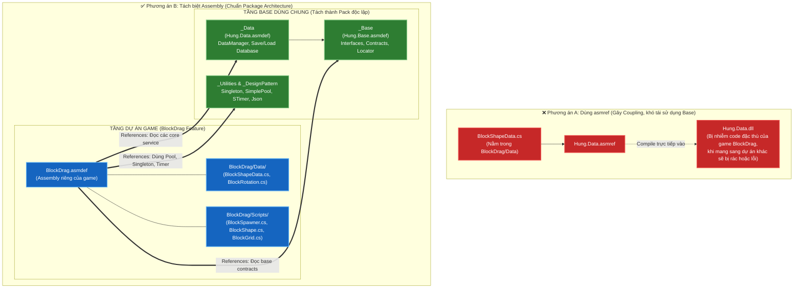
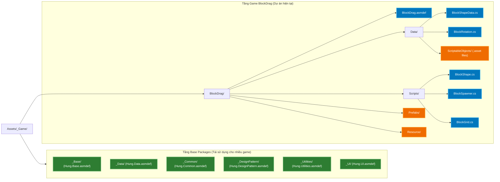
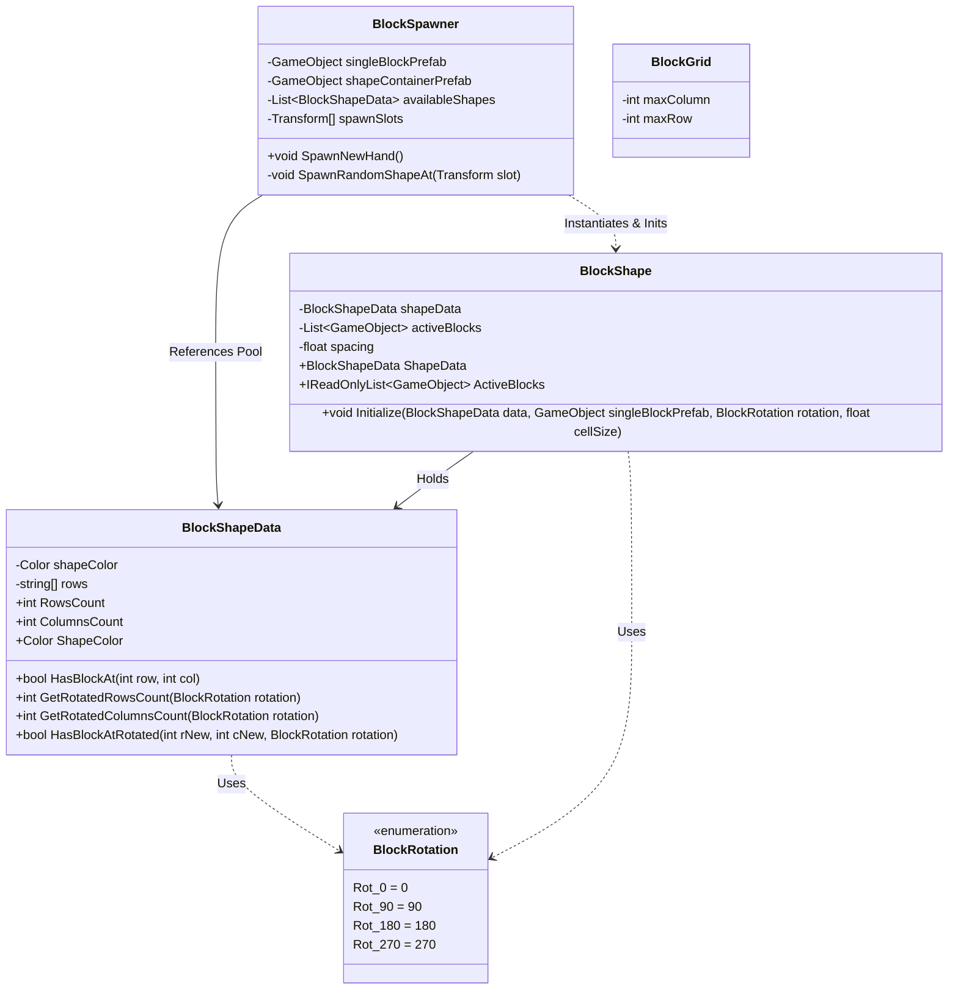

# Thiết Kế Kiến Trúc & Kế Hoạch Refactor Module BlockDrag

> **Tài liệu tham chiếu:** [`.agents/rules/architecture.md`](file:///Users/minhquang/Documents/Unity%20Project/BlockDrag/.agents/rules/architecture.md) & [`.agents/rules/task_planning.md`](file:///Users/minhquang/Documents/Unity%20Project/BlockDrag/.agents/rules/task_planning.md)  
> **Mục tiêu:** Tách bạch rõ ràng giữa **Tầng Base Framework dùng chung** (`_Base`, `_Data`, `_Common`, `_Utilities`, `_DesignPattern`) và **Tầng Game Feature cụ thể** (`BlockDrag`), sẵn sàng để sau này trích xuất tầng Base thành các gói Package/UPM độc lập.

---

## PHẦN 1: PHÂN TÍCH KIẾN TRÚC & GIẢI ĐÁP CỐT LÕI

### 1. Câu hỏi trọng tâm: Có nên tạo `BlockDrag/Data` rồi dùng `Hung.Data.asmref` không?

#### Bản chất kỹ thuật của Assembly Reference (`.asmref`) trong Unity:
- Một file `.asmref` hoạt động như một "lời chỉ thị" cho Unity: *“Mọi script nằm trong thư mục chứa file `.asmref` này sẽ không tạo assembly mới, mà được gom vào biên dịch chung bên trong DLL của assembly mà nó trỏ tới.”*
- Nếu bạn tạo `BlockDrag/Data/Hung.Data.asmref` trỏ tới `Hung.Data.asmdef`:
  - Unity sẽ đưa script [`BlockShapeData.cs`](file:///Users/minhquang/Documents/Unity%20Project/BlockDrag/Assets/_Game/BlockDrag/BlockShapeData.cs) trực tiếp vào trong thư viện `Hung.Data.dll`.

#### So sánh 2 hướng tiếp cận:

| Tiêu chí | ❌ Phương án A: Dùng `.asmref` trỏ vào `Hung.Data` | ✅ Phương án B: `BlockDrag` có `.asmdef` riêng (Khuyến nghị) |
| :--- | :--- | :--- |
| **Quyền sở hữu mã nguồn** | Mã nguồn của game `BlockDrag` bị nhồi chung vào DLL của tầng Base `Hung.Data`. | Tầng Base và Game tách rời 100%. `_Data` chỉ chứa generic core, `BlockDrag` chứa data đặc thù của game. |
| **Khả năng trích xuất Package (UPM / Git Submodule)** | **Rất kém**: Khi tách `_Data` thành thư viện dùng cho game khác (ví dụ: Game Bắn Súng), package `_Data` sẽ bị dính `BlockShapeData` dư thừa hoặc lỗi compile. | **Rất tốt**: Thư mục `_Data`, `_Base`, `_Utilities` hoàn toàn sạch, có thể xuất thành package tái sử dụng ngay lập tức. |
| **Tính đóng gói (Encapsulation)** | Thấp, ranh giới giữa Base và Gameplay bị xóa nhòa. | Cao, tuân thủ nguyên tắc Dependency Inversion (Game phụ thuộc vào Framework, Framework không phụ thuộc Game). |
| **Khả năng mở rộng của Game** | Hạn chế. Mọi ScriptableObject mới của game nếu muốn `DataManager` thấy đều phải nhét vào `Hung.Data`. | Linh hoạt. `BlockDrag` tự do tạo thêm `BlockLevelData`, `BlockSkinData`... trong assembly của chính mình. |

> [!IMPORTANT]
> **Kết luận kiến trúc**: Để đạt được mong muốn *"các folder `_Data`, `_Base`,... chứa base code có thể dùng chung cho nhiều project khác nhau"*, bạn **KHÔNG NÊN** dùng `.asmref` để nhồi code của `BlockDrag` vào `Hung.Data`. Thay vào đó, hãy tạo một Assembly Definition riêng cho game: [`BlockDrag.asmdef`](file:///Users/minhquang/Documents/Unity%20Project/BlockDrag/Assets/_Game/BlockDrag/BlockDrag.asmdef).

---

## PHẦN 2: CÁC SƠ ĐỒ THIẾT KẾ KIẾN TRÚC

> [!TIP]
> **Cách xem biểu đồ trực quan đẹp mắt:**
> 1. **Cách 1 (Nhanh nhất - Không cần cài gì):** Mở file HTML [architecture_diagram.html](file:///Users/minhquang/Documents/Unity%20Project/BlockDrag/Docs/plans/architecture_diagram.html) bằng trình duyệt (Chrome/Safari) - toàn bộ sơ đồ đồ họa màu sẽ hiển thị trực quan.
> 2. **Cách 2 (Trong IDE / VS Code):** Bấm phím tắt **`Cmd + Shift + V`** (hoặc `Cmd + K, V`) để mở chế độ Markdown Preview. Nếu chưa hiện hình, cài thêm extension **"Markdown Preview Mermaid Support"** (tác giả Matt Bierner).
> 3. **Cách 3:** Xem trực tiếp các **sơ đồ chữ (ASCII Diagram)** được vẽ ngay bên dưới mỗi mục!

### Sơ đồ 1: So sánh Bản chất giữa Dùng `.asmref` và Tách `.asmdef` riêng

#### 🖥️ Sơ đồ chữ trực quan (Xem ngay trong code editor):
```text
❌ PHƯƠNG ÁN A (DÙNG ASMREF - GÂY DÍNH MÃ NGUỒN):
┌─────────────────────────┐
│ BlockDrag/Data          │
│ - BlockShapeData.cs     │
│ - Hung.Data.asmref ─────┼──────┐ (Gộp mã nguồn)
└─────────────────────────┘      ▼
                      ┌──────────────────────────────────────┐
                      │ Hung.Data.dll (Bị nhiễm bẩn)         │
                      │ - Chứa DataManager, GameData...      │
                      │ - Chứa CẢ BlockShapeData (Rác)       │
                      └──────────────────┬───────────────────┘
                                         │
              ❌ Khi tách _Data làm Package mang sang game khác:
                 Game khác (bắn súng, đua xe) cũng bị dính BlockShapeData!

───────────────────────────────────────────────────────────────────────────

✅ PHƯƠNG ÁN B (TÁCH ASSEMBLY RIÊNG - CHUẨN MODULAR PACKAGE):
┌────────────────────────────────────────────────────────────┐
│ TẦNG BASE PACKAGES DÙNG CHUNG (Tách thành UPM độc lập)     │
│ ┌──────────────────────┐      ┌──────────────────────────┐ │
│ │ Hung.Base.asmdef     │◄─────┤ Hung.Data.asmdef         │ │
│ │ (Interfaces/Locator) │      │ (DataManager, Database)  │ │
│ └──────────────────────┘      └──────────────────────────┘ │
└──────────────────────────▲──────────────────▲──────────────┘
                           │ (Phụ thuộc       │
                           │  một chiều)      │
┌──────────────────────────┴──────────────────┴──────────────┐
│ TẦNG GAME FEATURE (Dự án BlockDrag cụ thể)                 │
│ ┌────────────────────────────────────────────────────────┐ │
│ │ BlockDrag.asmdef                                       │ │
│ │ ├─ Data/   : BlockShapeData.cs, BlockRotation.cs       │ │
│ │ └─ Scripts/: BlockSpawner.cs, BlockShape.cs            │ │
│ └────────────────────────────────────────────────────────┘ │
└────────────────────────────────────────────────────────────┘
              ✅ Tầng Base hoàn toàn sạch sẽ, không dính 1 dòng code game!
```

#### 📊 Sơ đồ Mermaid (Xem trong Preview hoặc file HTML):


---

### Sơ đồ 2: Cấu trúc Thư mục và Phân vùng Assembly sau Refactor

#### 🖥️ Sơ đồ cây thư mục trực quan (Xem ngay trong code editor):
```text
Assets/_Game/
├── _Base/               ───► Hung.Base.asmdef       (Interfaces, Locator, Enums)
├── _Data/               ───► Hung.Data.asmdef       (DataManager, Database Save/Load)
├── _Common/             ───► Hung.Common.asmdef     (GameEventManager, Events)
├── _DesignPattern/      ───► Hung.DesignPattern.asmdef (Singleton, SimplePool, Observer)
├── _Utilities/          ───► Hung.Utilities.asmdef  (STimer, Json, Helpers)
├── _UI/                 ───► Hung.UI.asmdef         (UIManager, Canvases)
│
└── BlockDrag/           ───► BlockDrag.asmdef       ★ MODULE GAME ĐỘC LẬP
    ├── Data/                                        (Chứa data riêng của game)
    │   ├── BlockShapeData.cs                        (ScriptableObject logic)
    │   ├── BlockRotation.cs                         (Enum xoay 0, 90, 180, 270)
    │   └── ScriptableObjects/                       (Các file .asset: Block_I, Block_L...)
    │
    ├── Scripts/                                     (Chứa gameplay controllers)
    │   ├── BlockShape.cs                            (Ghép các ô vuông 1x1 thành hình)
    │   ├── BlockSpawner.cs                          (Sinh khối ngẫu nhiên tại 3 slot)
    │   └── BlockGrid.cs                             (Bàn cờ ma trận)
    │
    ├── Prefabs/                                     (BlockShape.prefab, SingleBlock.prefab)
    └── Resource/                                    (Sprites, Textures...)
```

#### 📊 Sơ đồ Mermaid (Xem trong Preview hoặc file HTML):


---

### Sơ đồ 3: Biểu đồ Lớp (Class Diagram) và Quan hệ trong Module `BlockDrag`

#### 🖥️ Sơ đồ quan hệ lớp trực quan (Xem ngay trong code editor):
```text
┌─────────────────────────────────┐
│       <<enum>> BlockRotation    │
│  Rot_0, Rot_90, Rot_180, Rot_270│
└────────────────┬────────────────┘
                 │ (sử dụng)
                 ▼
┌────────────────────────────────────────────────────────┐
│ BlockShapeData : ScriptableObject                      │
│ - Color shapeColor                                     │
│ - string[] rows                                        │
│ + int RowsCount, ColumnsCount                          │
│ + bool HasBlockAt(row, col)                            │
│ + bool HasBlockAtRotated(row, col, BlockRotation rot)  │
└────────────────┬───────────────────────────────────────┘
                 │
                 │ (tham chiếu dữ liệu)
                 ▼
┌────────────────────────────────────────────────────────┐
│ BlockShape : MonoBehaviour                             │
│ - BlockShapeData shapeData                             │
│ - List<GameObject> activeBlocks                        │
│ - float spacing = -0.4f                                │
│ + void Initialize(data, blockPrefab, rotation, size)   │
└────────────────▲───────────────────────────────────────┘
                 │ (Instantiate & Init)
┌────────────────┴───────────────────────────────────────┐
│ BlockSpawner : MonoBehaviour                           │
│ - GameObject singleBlockPrefab                         │
│ - GameObject shapeContainerPrefab                      │
│ - List<BlockShapeData> availableShapes                 │
│ - Transform[] spawnSlots (3 slots chờ dưới đáy)        │
│ + void SpawnNewHand()                                  │
└────────────────────────────────────────────────────────┘
```

#### 📊 Sơ đồ Mermaid (Xem trong Preview hoặc file HTML):


---

## PHẦN 3: KẾ HOẠCH TRIỂN KHAI CHI TIẾT (IMPLEMENTATION PLAN)

### Danh sách các file bị tác động:
1. `Assets/_Game/BlockDrag/BlockDrag.asmdef` (Tạo mới)
2. `Assets/_Game/BlockDrag/BlockRotation.cs` (Tạo mới, tách enum)
3. `Assets/_Game/BlockDrag/BlockShapeData.cs` (Sửa: thêm namespace, bảo vệ encapsulation, bỏ enum thừa)
4. `Assets/_Game/BlockDrag/BlockShape.cs` (Sửa: thêm namespace, chuyển field sang `[SerializeField] private`)
5. `Assets/_Game/BlockDrag/BlockSpawner.cs` (Sửa: thêm namespace, chuyển field sang `[SerializeField] private`)
6. `Assets/_Game/BlockDrag/BlockGrid.cs` (Sửa: thêm namespace)

---

### Task 1: Tách Enum `BlockRotation.cs`
- **File tạo mới:** `Assets/_Game/BlockDrag/BlockRotation.cs`
- **Nội dung:**
  ```csharp
  namespace _Game.BlockDrag.Data
  {
      public enum BlockRotation
      {
          Rot_0 = 0,
          Rot_90 = 90,
          Rot_180 = 180,
          Rot_270 = 270
      }
  }
  ```
- **Xác minh:** File tạo thành công, có `.meta` tự sinh bởi Unity hoặc giữ định dạng meta chuẩn.

---

### Task 2: Chuẩn hóa ScriptableObject `BlockShapeData.cs`
- **File sửa:** `Assets/_Game/BlockDrag/BlockShapeData.cs`
- **Lưu ý cốt lõi:** Giữ nguyên file [`BlockShapeData.cs.meta`](file:///Users/minhquang/Documents/Unity%20Project/BlockDrag/Assets/_Game/BlockDrag/BlockShapeData.cs.meta) (GUID `c314d30bc4d7d4f41b8c9faaa52a4356`) để các file asset `Block_I.asset`, `Block_L.asset` không bị `Missing Script`.
- **Nội dung chuẩn hóa:**
  - Namespace: `_Game.BlockDrag.Data`
  - Encapsulation: Chuyển `public Color shapeColor` và `public string[] rows` thành `[SerializeField] private` kèm getter property.
  - Xóa khai báo `BlockRotation` ở cuối file vì đã tách sang Task 1.

---

### Task 3: Tạo Assembly Definition `BlockDrag.asmdef`
- **File tạo mới:** `Assets/_Game/BlockDrag/BlockDrag.asmdef`
- **Nội dung cấu hình Assembly:**
  ```json
  {
      "name": "BlockDrag",
      "rootNamespace": "_Game.BlockDrag",
      "references": [
          "Hung.Base",
          "Hung.Data",
          "Hung.Common",
          "Hung.DesignPattern",
          "Hung.Utilities",
          "Unity.TextMeshPro"
      ],
      "includePlatforms": [],
      "excludePlatforms": [],
      "allowUnsafeCode": false,
      "overrideReferences": false,
      "precompiledReferences": [],
      "autoReferenced": true,
      "defineConstraints": [],
      "versionDefines": [],
      "noEngineReferences": false
  }
  ```
- **Xác minh:** Assembly được tạo với GUID độc lập, không xung đột reference.

---

### Task 4: Chuẩn hóa các Script Gameplay (`BlockShape`, `BlockSpawner`, `BlockGrid`)
- **Files sửa:**
  - `Assets/_Game/BlockDrag/BlockShape.cs`:
    - Namespace: `_Game.BlockDrag.Gameplay`
    - Using: `using _Game.BlockDrag.Data;`
    - Đổi `public BlockShapeData shapeData;` -> `[SerializeField] private BlockShapeData shapeData;`
    - Đổi `public float spacing = 0.1f;` -> `[SerializeField] private float spacing = 0.1f;`
    - Giữ nguyên tên field để prefab [`BlockShape.prefab`](file:///Users/minhquang/Documents/Unity%20Project/BlockDrag/Assets/_Game/BlockDrag/Prefabs/BlockShape.prefab) không mất giá trị `spacing: -0.4`.
  - `Assets/_Game/BlockDrag/BlockSpawner.cs`:
    - Namespace: `_Game.BlockDrag.Gameplay`
    - Using: `using _Game.BlockDrag.Data;`
    - Đổi các field Inspector thành `[SerializeField] private`.
  - `Assets/_Game/BlockDrag/BlockGrid.cs`:
    - Namespace: `_Game.BlockDrag.Gameplay`

---

### Task 5: Kiểm tra và Xác thực Tính Toàn Vẹn
1. **Kiểm tra biên dịch:** Không còn class nào rơi vào `Assembly-CSharp.dll` ngoài ý muốn. Không có lỗi `CS0246` (thiếu namespace/assembly).
2. **Kiểm tra Assets:** 6 asset khối gạch (`Block_I`, `Block_L`, `Block_S`, `Block_Square`, `Block_T`, `Block_Z`) vẫn liên kết đúng script `BlockShapeData`.
3. **Kiểm tra Scene & Prefab:** Scene `GameScene.unity` và Prefab `BlockShape.prefab` giữ nguyên các serialized fields, không bị cảnh báo `Missing (MonoBehaviour)`.
